# Light Phone III Modding Guide

> **Third-party reference document, reproduced for convenience.** Written by *sir bloody sabbath*
> and shared as [`Light Phone III Modding Guide.pdf`](https://acrobat.adobe.com/id/urn:aaid:sc:US:0c80fa32-de30-406f-85ca-93ccd92c3c4b)
> (168 pages, last revised 20 Jul 2026). Converted to Markdown on 26 Jul 2026 with
> [`convert.py`](convert.py); screenshots were downscaled to 480px and live in [`images/`](images/).
> The PDF remains the source of truth — it is updated frequently, and the author asks that changes
> be submitted as document change requests. Text is reproduced as written, including the author's
> disclaimers about warranty and bricking risk.

## Contents

- [Light Phone III Hybrid / Full Android Modding Guide](#light-phone-iii-hybrid-full-android-modding-guide)
- [Preface](#preface)
- [Technical Context](#technical-context)
  - [Android Layers](#android-layers)
  - [What is ‘Accessing Android’?](#what-is-accessing-android)
  - [Security Concerns](#security-concerns)
- [Use Cases](#use-cases)
- [How to Access the Android Layer](#how-to-access-the-android-layer)
- [Developer Options](#developer-options)
  - [Android](#android)
  - [LightOS](#lightos)
    - [In Android Settings](#in-android-settings)
    - [In LightOS](#in-lightos)
- [Setting Up Android](#setting-up-android)
  - [Default Applications](#default-applications)
  - [Keyboard](#keyboard)
  - [Gesture Navigation](#gesture-navigation)
  - [Display and Font Size](#display-and-font-size)
  - [Enabling Lock Screen](#enabling-lock-screen)
  - [Notifications](#notifications)
- [Applications](#applications)
  - [Clients](#clients)
    - [Aurora Store](#aurora-store)
    - [FOSS Clients](#foss-clients)
    - [Obtainium](#obtainium)
  - [Google](#google)
    - [Google Framework Services](#google-framework-services)
  - [Launchers](#launchers)
    - [Luma](#luma)
    - [Before Launcher](#before-launcher)
    - [Olauncher](#olauncher)
    - [Square Home](#square-home)
    - [folder launcher](#folder-launcher)
    - [Ion Launcher](#ion-launcher)
    - [Niagara Launcher](#niagara-launcher)
    - [inkOS](#inkos)
  - [FOSS Alternatives](#foss-alternatives)
  - [Additional Applications](#additional-applications)
    - [Community-Made Light Tools](#community-made-light-tools)
    - [Security and privacy](#security-and-privacy)
    - [Internet](#internet)
    - [Travel / Media](#travel-media)
    - [Functionality (not optional)](#functionality-not-optional)
    - [Communication](#communication-1)
    - [Isolation](#isolation)
    - [Email](#email)
- [Key Maps and Macros](#key-maps-and-macros)
  - [Key Mapper](#key-mapper)
    - [Installation](#installation)
    - [Creating Key Maps](#creating-key-maps)
    - [Recreating LightOS Button Functionality](#recreating-lightos-button-functionality)
    - [Hybrid Mode Specific Key Maps](#hybrid-mode-specific-key-maps)
    - [Other Key Maps](#other-key-maps)
  - [MacroDroid](#macrodroid)
    - [Installation](#installation-1)
    - [Introduction to MacroDroid](#introduction-to-macrodroid)
    - [Hybrid Mode Specific Macros](#hybrid-mode-specific-macros)
- [Hybrid Mode](#hybrid-mode)
- [Full Android](#full-android)
  - [Global Setting: light_mode](#global-setting-light_mode)
    - [What is light_mode?](#what-is-light_mode)
    - [Change Launcher](#change-launcher)
    - [ADB](#adb)
  - [Disabling LightOS](#disabling-lightos)
    - [ADB via Android SDK](#adb-via-android-sdk)
    - [ADB via Shizuku/aShell](#adb-via-shizukuashell)
  - [Enabling LightOS](#enabling-lightos)
  - [Full Android without ADB](#full-android-without-adb)
  - [Global Settings: Other](#global-settings-other)
- [SDK](#sdk)
  - [Tool Library](#tool-library)
  - [For Developers](#for-developers)
  - [Installing External Tools](#installing-external-tools)
    - [In Light Account Dashboard](#in-light-account-dashboard)
    - [In LightOS](#in-lightos-1)
    - [On the Light Phone](#on-the-light-phone)
    - [Installing Applications](#installing-applications)
  - [Disable / Enable Auto-Foreground](#disable-enable-auto-foreground)
    - [Level 0 (Disabled)](#level-0-disabled)
    - [Level 1 (Notification Focus)](#level-1-notification-focus)
    - [Level 2 (App/Tool Focus)](#level-2-apptool-focus)
- [Additional Guides](#additional-guides)
  - [Disabling 5G](#disabling-5g)
    - [What is 5G/NR?](#what-is-5gnr)
    - [Disabling 5G/NR on Android](#disabling-5gnr-on-android)
  - [Battery Optimisation](#battery-optimisation)
    - [Basic Battery Optimisation](#basic-battery-optimisation)
    - [How I Optimised My Light Phone](#how-i-optimised-my-light-phone)
  - [Syncing](#syncing)
    - [To Disable](#to-disable)
    - [To Reconfigure](#to-reconfigure)
  - [Light Phone II Root](#light-phone-ii-root)
    - [Android 11 Installation](#android-11-installation)
    - [Other Useful Settings](#other-useful-settings)
    - [References](#references)
- [Afterword](#afterword)
- [Document Change History](#document-change-history)
  - [Changes](#changes)

## Light Phone III Hybrid / Full Android Modding Guide

## Preface

It has been widely requested via Discord that I revise the existing Light Phone Modding Guide since it’s difficult to follow as well as missing key information that is leaving people with questions. I will be covering the ways to access the Android layer as well as Hybrid and Full Android Mode, and an included guide for the SDK, as well as guides on how to optimise the phone, perform certain commands and give you control over the phone.

In terms of liability, I am not liable if you mess up and/or brick the device. I have tried to make this as idiot-proof as possible to minimise the risks involved, but if you do something wrong, I am not at fault for it. There is a risk to modding a phone, especially in terms of jailbreaking or even delving into the lower levels of the API.

IF you do not understand the more advanced parts of this guide, do NOT attempt them. If you do not have an understanding of what you are doing, you are far more likely to break something.

Additionally, per [this comment from Joe Hollier via Reddit](https://www.reddit.com/r/LightPhone/comments/1jxtw0j/comment/mpvx94e/), Light deems use of the Android layer that results in a bricking or breaking the device as voiding the warranty of the phone. Know the risks involved and proceed with caution.

I will try to provide screenshots as much as possible, although I am doing this retroactively and have LightOS disabled and I will sometimes use a form of arrow syntax to denote how to navigate to a certain screen. It is a shorthand way to tell you where you need to navigate within the phone.

```
i.e.      Settings > System > Developer Options
```

This file is best viewed as a PDF or the original .docx file. A lot of the original formatting and OCR is lost during conversion to Google Docs. This document is also frequently being updated. All updates are viewable in the Document Change History [HERE](#changes).

This guide is not meant to be followed top down. It is simply a compilation of information that I have acquired over a few months with the Light Phone III and everything I wish to share and give back to the community.

Initially starting out, you want to access Android first, then set Android up and your key maps to access Android again. Everything else is for you to use at your own discretion.

This guide relies on the navigation pane to denote different sections. Any indented sections are sub-sections of the main section. Using Adobe Acrobat, you can find the navigation pane on the right side of the screen under Bookmarks:

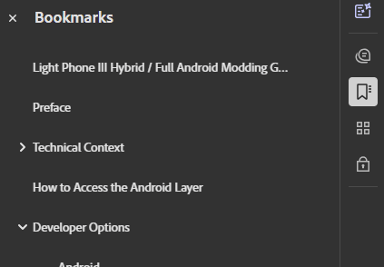

\* If you wish to skip the technical jargon, you can click [HERE.](#how-to-access-the-android-layer)

## Technical Context

I understand that LightOS doesn’t fit the use cases of some of its users, and it will continue to be a work in progress for many years to come. Some users enjoy the LightOS aesthetic and ethos, whereas some feel it is lacking.

Regardless of your feelings on the matter, it’s important to make the distinction between an operating system (OS) and a launcher. LightOS is not an OS. The operating system on the phone is Android 14 and the launcher is a React Native App built on top of vanilla Android 14. Their operating system of sorts *is* code-signed to AOSP platform keys which allows their launcher app to access lower-level APIs, drivers and firmware that normal apps are not allowed to access. This allows their launcher app to embed into the depths of the phone – this is how it works independently of any vanilla AOSP applications that are present on vanilla Android. You can read more in depth about how they developed the React Native app [here](https://medium.com/sanctuary-computer-inc/building-lightos-with-react-native-4b6e4ad1cd7f).

Now, you may be asking about rooting the phone. As of the beginning of September 2025, there is no root available for the phone. While it is *possible* to root the phone at this time, it is not recommended. There is no custom recovery for the phone. If you so choose to root the Light Phone III with a patched image file of Android 14, do understand that we do not have access to the drivers – you will lose functionality of some of the additional hardware that came with the phone.

### Android Layers

For those who do not have a general understanding of layers, I’ll do my best to explain it and have provided a diagram in Figure 1.1. for visual representation.

First, we have the API layer for applications. This is the user-facing software side and where users interact with the device. Applications or APKs are typically developed in Java / Kotlin but may include JavaScript (JS), CSS and Python to name a few. All applications, AOSP, LightOS, etc. have their user-interface on this level.

Secondly, we have the middleware layer, which allows our high-level (APKs, GUI, etc.) to communicate with our low-level. It is our program layer that contains the framework for applications to run. It’s everything that allows an application to operate in the way it does. It also contains the libraries for developers and programs to access lower-level OS and hardware primitives and privileges. This is typically implemented with C++ / C, although SQL, Scala, Python and PHP, etc. can be used in this level as well.

API for Applications

Implemented in Java

Middleware

Implemented in C++

Kernel Driver

Implemented in C

Figure 1.1 – Simple flow diagram showing the core layers of Android and the main languages used to implement them within a device.

Finally, we have our low-level layer, the Kernel Driver layer. Android is built off of Linux, so the root component is the Linux Kernel. This is base hardware level that contains device drivers, memory and process management and is typically implemented in C but Java can also be used. There are two sub-layers to our lowest-level within Android – Hardware Abstraction Layer (HAL) and the Linux Kernel, but to keep it simple, we’ll just refer to this as the lowest-level within Android as a whole. Anything that is considered additional hardware needs a driver in order for the software side to interact with it, otherwise it’s useless. USB, Bluetooth, Wi-Fi, display, audio, power manager, flash memory, binders, camera, microphone, antenna, all of these additional devices will not work without the necessary drivers supplied by their respective manufacturers. No drivers = the operating system can’t use them. In the case of the Light Phone III, we also need to make mention of the flashlight button, scroll wheel, home button and camera button. Within the Linux kernel, we also have our memory management that manages memory space to ensure applications don’t conflict and overwrite each other. The Linux kernel also contains the process management, which manages different processes running on the phone which can include: creating, pausing, stopping, or killing processes. The kernel layer is responsible for communicating between different processes, allocating RAM as necessary for applications as well as ensuring it is freed up when processes are killed and maximising the performance of the device.

### What is ‘Accessing Android’?

In the context of accessing the Android layer, it’s crucial to understand what we are actually doing when we access it. LightOS sits on top of vanilla Android but does not replace it. When we access the Android layer, we are simply stepping outside of the bounds of what the LightOS app runs in. Originally, with version v4xx (typically v466) there was a key sequence that was available to access the Android layer. Since users were accidentally accessing Android, it was patched in later versions. There is only way to access it reliably, which is via a keyboard which is explained [HERE](#how-to-access-the-android-layer).

When we access the Android layer in terms of using it in tandem with LightOS, we are staying within the high-levels of Android. We aren’t changing the functionality of the phone or LightOS and are simply giving us, the user, access to a different part of the phone on the same level. We aren’t changing anything deep within the phone at this point so there is far less risk to the device.

### Security Concerns

There are many implications from having easy access to Android, whether or not you are aware of it, the biggest of which is the security of the device. LightOS has its own version of a lock screen, however, even with that enabled and a keyboard handy, you’re still able to access the Android layer and access files that are typically hidden behind LightOS’s application. It is imperative to lock the phone, LightOS and Android alike, to prevent any unauthorised use whether that be from prying eyes, unsavoury figures, or accidental use like, say, butt dials.

For the security of the device locally, I like to use an analogy of Android acting as your home. Assuming that there are no lock screens enabled (either on Android or LightOS), it is like saying there are no doorknobs or locks on the doors. LightOS is a single room in said house. Enabling a lock screen only on LightOS is like having a single doorknob to that room, but it isn’t truly locked. This means that everything in the LightOS ‘room’ can still be seen and accessed by anyone that has access to the house. It’s under the false pretense that it is locked and secured but in reality it is not. Another thing to assume is that the low-level API and relevant source code is treated like the electrical panel. No one has a key to this except the owners of the house (the developers) and it is what powers the house.

Using this analogy, we, as the user, are able to freely roam through the house (our Android device) which also includes the LightOS ‘room’ but we do not have access to the electrical panel and its subsequent root/su (superuser) privileges. When you enable the lock screen on LightOS, you are simply putting a doorknob on the door but it is not truly locked. Enabling a lock screen on the Android side is like installing true locks and doorknobs on the house to secure it. That doesn’t mean it’s impenetrable, just harder to get into.

Another thing to note is the implementation of DAVx5. DAVx5 is a syncing and management application that is free and open-source. It is used to sync relevant information from your device to Light’s servers via CalDAV, CardDAV and WebDAV infrastructures. This is how you are able to sync your texts, contacts, pictures, music, podcasts, etc., with your Light Account Dashboard. If you want to continue using this function, you’re more than welcome to. However, I find issue with how the users were not given the *option* to opt out of the service outside of not connecting the device to a Light Account. While Light claims its stance on privacy away from big tech, I have a hard time swallowing that it is completely harmless. I have it disabled but you are free to continue using it if you so wish. The guide to disable/reconfigure DAVx5 is [HERE](#syncing).

## Use Cases

For anyone wishing to access the Android layer, there are a few different distinctions: Hybrid Mode and Full Android. Hybrid Mode is a use case for those who wish to use LightOS but require some additional applications for them to make a complete switch to the phone whereas Full Android is for folks who wish to completely do away with LightOS on the phone.

Both have their pros and cons and it is highly recommended you read each one to determine which fits your use case.

To read more about Hybrid Mode, click [HERE](#hybrid-mode).

To read more about Full Android, click [HERE](#full-android).

\* Update: the [Light SDK](https://github.com/lightphone/light-sdk) is now available. This enables the option for user-installed applications outside of LightOS to populate in LightOS instead of needing a separate launcher and a way to swap in-between the Android layer and LightOS. For those that wish to do so, please follow the guide in the [SDK section](#tool-library).

## How to Access the Android Layer

\* Note: As of [Firmware v.1.440000](https://support.thelightphone.com/hc/en-us/articles/360031105751-Software-Versions-Change-Log), from 29 September 2025, Light has officially patched some Android access loophole for USB-C keyboards and by plugging the Light Phone into a smartphone (see [Software Versions & Change Log](https://support.thelightphone.com/hc/en-us/articles/360031105751-Software-Versions-Change-Log)). Even if you factory reset the phone, firmware updates will still persist. Factory resetting a device only removes user data in the user partition.

Any keyboard combos or key sequences noted prior to October 2025, are no longer able to be used.

Follow the instructions below for the updated access.

What you will need:

- Light Phone III
- Keyboard (either wired USB-C connection or wireless)

`o` If the keyboard is wired but doesn’t have USB-C, USB-A to USB-C adapters will work fine as well. `o` Do not use any keyboards that have RGB or additional firmware – mobile phones do not supply enough power to power these keyboards and they will not work.

1. Unlock the Light Phone III.
2. Connect your keyboard to the device.
3. Use the key sequence `WIN + B` to open Chromium (AOSP web browser).

a. If you previously accessed the Android layer, you may be presented with multiple options. Pick one, it doesn’t matter. b. If you have not previously accessed the Android layer, you will NOT get this screen as your default will already be Chromium.

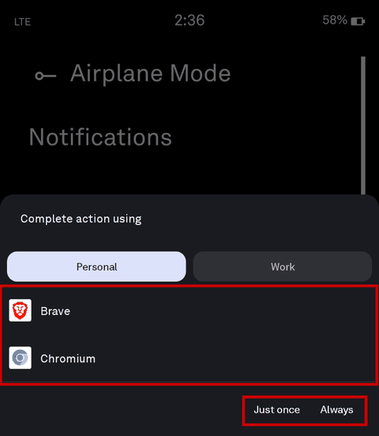

4. Hold ALT + TAB, but do not release these keys.

a. This will open your recent apps.

5. Find Chromium and tap on the icon.

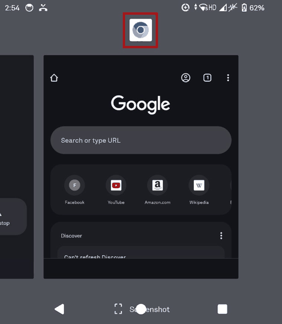

6. Select ‘App Info’.

a. You can release the TAB key, but do not release ALT. b. This will open the app in the system settings.

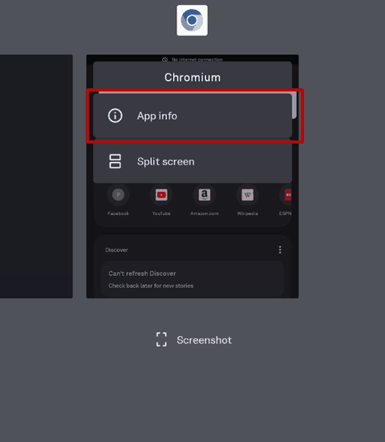

7. Once you see the following screen, depress ALT + TAB once more but do not release the

keys.

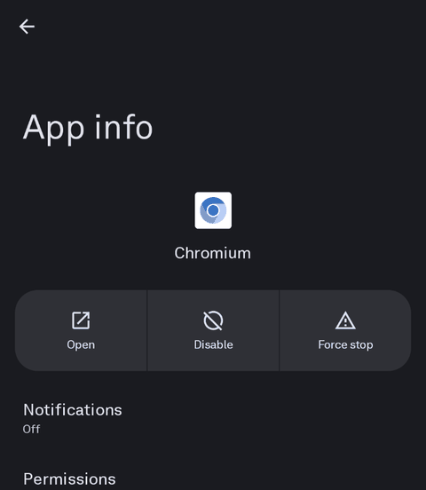

8. Find Settings and tap on the icon.

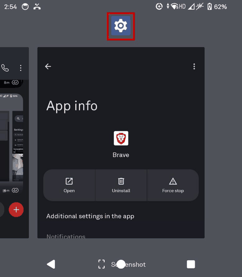

9. Select ‘App Info’.

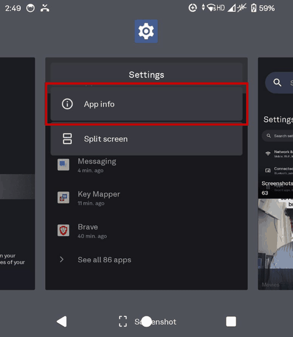

10. Select ‘Open’.

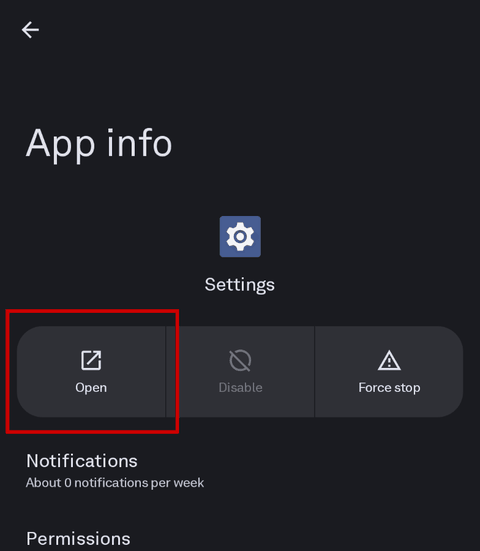

11. You’re now in the Android System Settings.

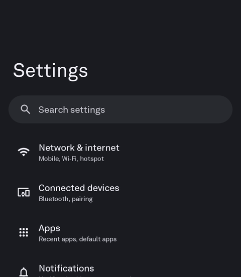

## Developer Options

There are two different developer options, one in LightOS and one in Android. They both have different ways of accessing them.

Android developer options will give you more access to side-loading and installing applications or granting permissions to applications.

LightOS developer options will give you access to the entire ‘tools’ list including Beta ‘tools’ without connecting a Light Account to access them. This is also how you can disable `light_mode` and use Change Launcher is covered [HERE](#global-setting-light_mode).

### Android

```
Settings > ‘About Phone’ > ‘Build Number’
```

1. In Settings, you will navigate all the way down to the bottom of the screen where it says

‘About Phone’.

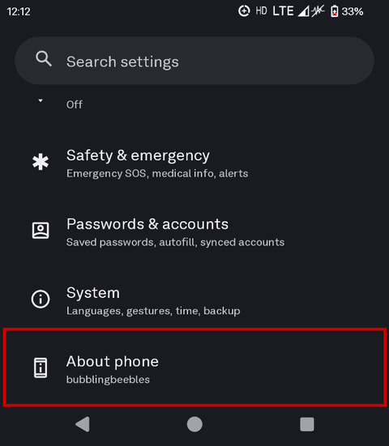

2. Navigate to the bottom of the screen again to find ‘Build Number’.

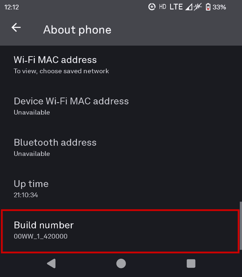

3. Tap the build number seven (7) times. You will then receive a prompt at the bottom of the

screen confirming developer options are enabled.

4. To locate developer options in the future:

a. Search with keywords using the search bar in Settings.

```
b. Locate it in System > ‘Developer Options’
```

\* Note: the [original modding guide](https://docs.google.com/document/d/1aDvuVqibzC8x0FpuHaJw5llYmERLgU8CwcEHg9hHZqc/edit?tab=t.0#heading=h.wb5q0wyzm1wb) makes mention of ‘OEM Unlocking’ as something to enable after enabling developer options. This is not necessary for the majority of people and will only open the phone up to potential security risks. When the bootloader is unlocked or a root is achieved, this can be then be used but until then, there is no need to enable this setting.

### LightOS

#### In Android Settings

\* Note: As of [Firmware v.1.440000](https://support.thelightphone.com/hc/en-us/articles/360031105751-Software-Versions-Change-Log), access to LightOS Developer Options is no longer possible as the factory version is now reverted to v52x or higher. Prior key combination no longer works. You can still access Android and opt for ‘Full Android’ and all it has to offer without enabling LightOS Developer Options.

\* UPDATE: Following the release of the SDK, another option to enable LightOS Developer Options was released to the public.

1.Open the ‘Phone’ tool in LightOS. 2.Dial: \*7412369# and place the call. 3.This will enable/disable developer mode in LightOS.

This section will be left up for reference or if possible, can be used in the future.

\* Note: this will factory reset the LightOS app. Any Light Account information will be deleted as well as any software updates that may be on the phone. Any data such as contacts, call logs, texts, photos or music that is stored locally on the phone can still be accessed after this.

If you are performing this step later on after enabling Hybrid / Full Android Mode, make sure your default applications are all set to LightOS prior to enabling developer options on the LightOS Side. Changing default applications can be found [HERE](#default-applications).

```
Settings > Apps > ‘All Apps’ > ‘LightOS’ > ‘Uninstall Updates’
```

1. Navigate to ‘Apps’.

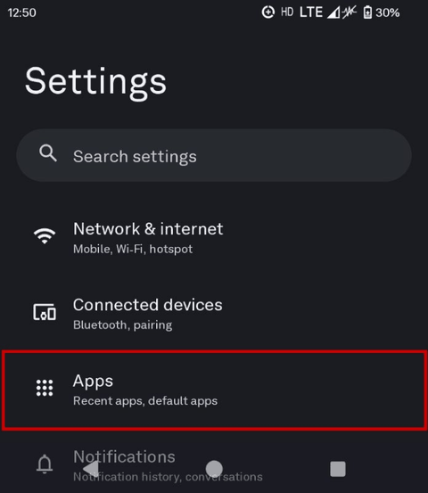

2. Navigate to ‘All Apps’.

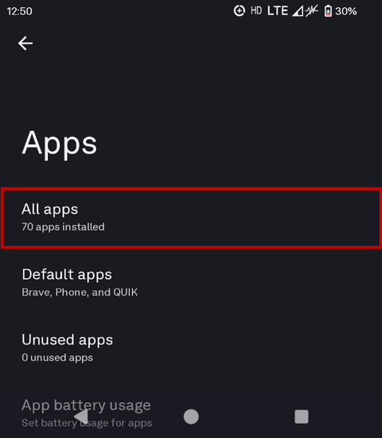

3. Find and select ‘LightOS’.

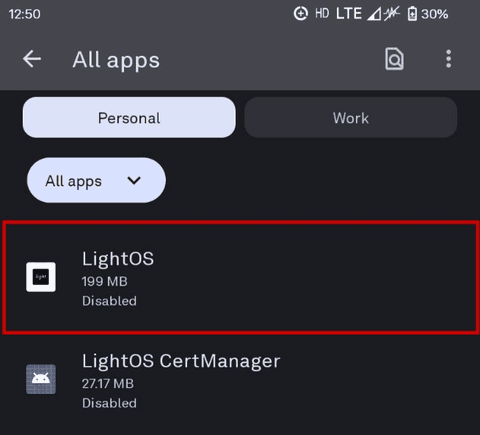

4. Tap the 3 vertical dots at the top right-hand corner of the screen and select ‘Uninstall

Updates’. Confirm following prompts.

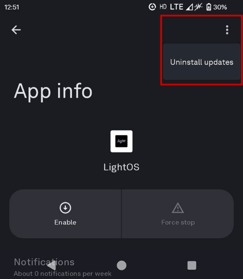

5. Verify the version of the LightOS app. It should say v4xx (likely v466). If it shows v52x or

higher, you will not be able to enable LightOS developer options.

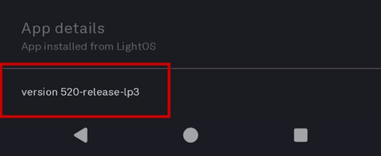

1. Prior to opening LightOS, verify your phone is connected to Wi-Fi and reboot it.
2. When opening LightOS, you will be met with the initial phone set-up screen. Do NOT

accept anything at this point.

3. With ‘UP’ referring to the VOLUME UP button and ‘DOWN’ referring to the VOLUME DOWN

button, perform the following key sequence:

#### In LightOS

a. If you have a case on the phone, I would highly recommend taking it off so you are

```
DOWN DOWN UP UP DOWN UP HOME
```

able to perform the key sequence accurately and correctly. b. You’ll need to perform the key sequence quite quickly and it may take a few tries.

4. If done correctly, you will get a brief splash screen stating ‘developer options enabled’.
5. You can now proceed through the initial phone set-up and update the phone. The

developer options will persist through updates so you don’t need to worry about them disappearing when updating the phone.

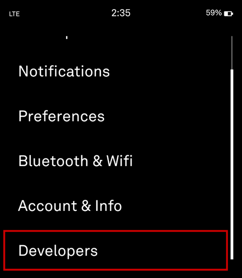

## Setting Up Android

This section is applicable to both Hybrid and Full Android users.

### Default Applications

Within Android Settings, you will need to change the default applications of the Phone, Messaging and Home app. The AOSP options are fine for now while we set up the Android layer. This section is simply for the initial set-up of Android.

\* Note: If at any point you accidentally select LightOS as the default Home app while setting up Android, it will reboot back into LightOS and you will have to access Android via a keyboard or keymap again.

1. In Settings, navigate to ‘Apps’.

```
Settings > Apps > ‘Default Apps’ > [Select Default applications]
```

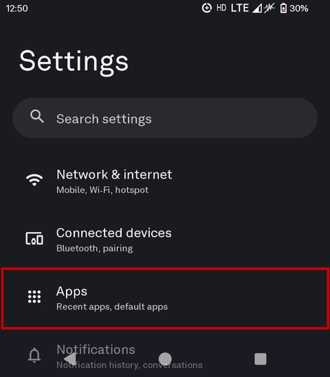

2. Select ‘Default apps’.

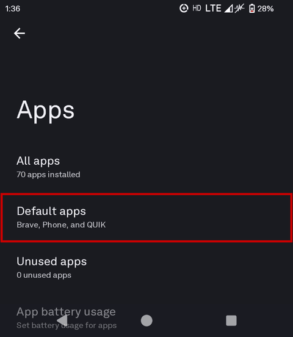

3. Here you will see the following screen:

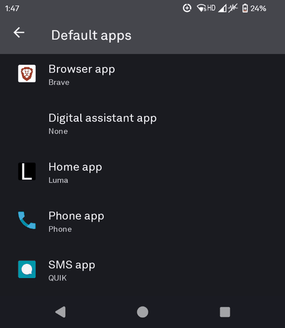

4. Here is the screen where you can select the default applications:

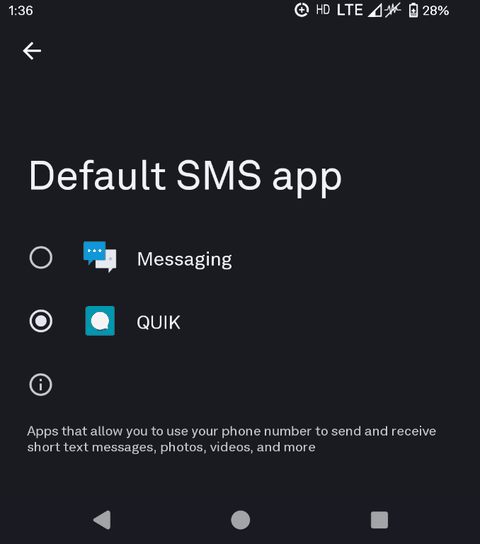

5. Change and/or verify your default applications are as follows:

- Browser app: Chromium
- Home app: QuickStep
- Phone app: AOSP Phone
- SMS app: Messaging

If you are using Hybrid Mode, once Android has been set up to your liking, you will need to change your default applications back to LightOS. You MUST do it in this order: Phone, then SMS, and finally Home. If you set the default Home to LightOS first, you will still have to go back to Android to set the defaults for the Phone and SMS in order to continue to receive calls and texts in LightOS.

### Keyboard

This allows you to type without needing the keyboard attached to the phone.

```
Settings > System > ‘Keyboard’ > ‘On-screen keyboard’ > Enable Android
Keyboard (AOSP)
```

1. In Settings, navigate to ‘System’.


2. Navigate to ‘Keyboard’.

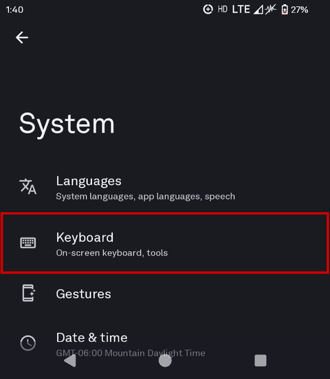

3. Select ‘On-screen keyboard’.

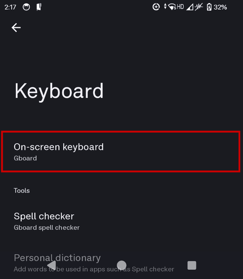

4. Find ‘Android Keyboard (AOSP)’ and enable it.

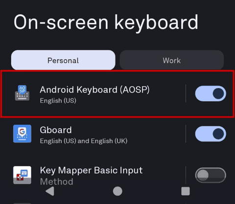

Whenever you have Android completely set up, feel free to change the keyboard to one of your choice. Some keyboards I would recommend for the Light Phone III are FlorisBoard (FOSS and customisable), FUTO Keyboard (FOSS and has swipe typing) or HeliBoard (FOSS). I do not have any recommendations for other languages at this moment. Should you wish to use it, Gboard works as well, although not ideal for privacy purposes.

### Gesture Navigation

This is for basic navigation between apps, the home screen and recent applications. It will allow you to switch between apps on the Android side.

For Hybrid users, you do not have the option to select 3-button navigation. LightOS uses a global setting called `light_mode` which disables 3-button navigation, the status bar and other missing UI elements on Android. Every time LightOS is opened, `light_mode` is changed to [1] and is enabled again, even if you disable it with [0].

Only Full Android users will be able to use the full functionality of 3-button navigation, the Android status bar and any formerly missing UI elements without needing to constantly change `light_mode`. You can find out how to disable `light_mode` [HERE](#global-setting-light_mode).

```
Settings > System > ‘Gestures’ > ‘Navigation Mode’ > ‘Gesture Navigation’
```

1. In Settings, navigate to ‘System’.

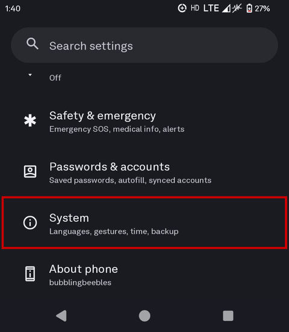

2. Navigate to ‘Gestures’.

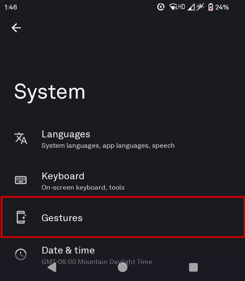

3. Select ‘Navigation Mode’.

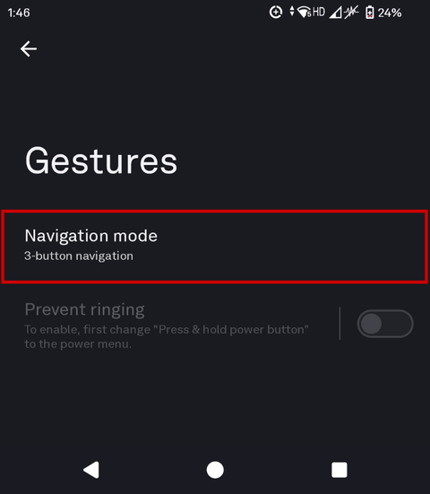

4. Select ‘Gesture navigation’.

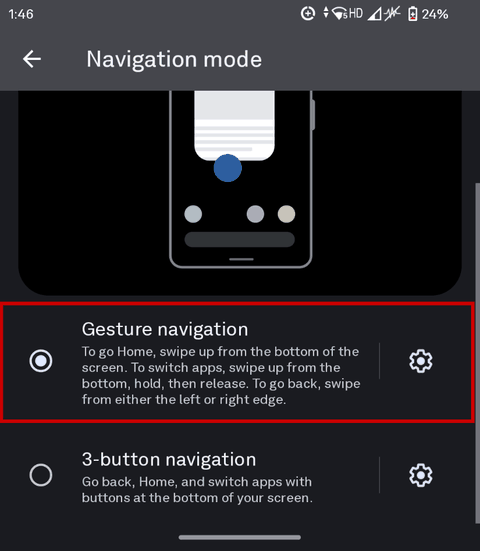

### Display and Font Size

Changing the display and font size is imperative in order to be able to see things on the screen that may not correct with the aspect ratio of the display. A common issue I’ve noticed with the [original modding guide](https://docs.google.com/document/d/1aDvuVqibzC8x0FpuHaJw5llYmERLgU8CwcEHg9hHZqc/edit?tab=t.0#heading=h.wb5q0wyzm1wb) is that people seem to struggle with setting up the key maps by not being able to see the trigger option. You will only be able to see the trigger option IF you change the display and font size accordingly.

```
Settings > System > ‘Display’ > ‘Display size and text’ > ‘Font /
Display size’
```

1. In Settings, navigate to ‘Display’.

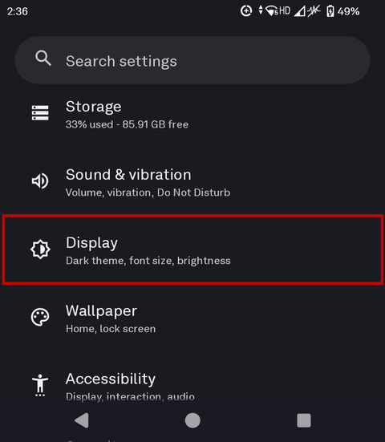

2. Navigate to ‘Display size and text’.

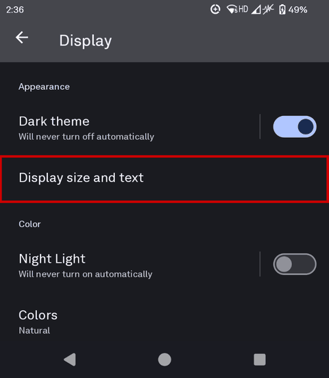

3. Find ‘Font Size’ and ‘Display size’. Make sure they are at the smallest size possible.

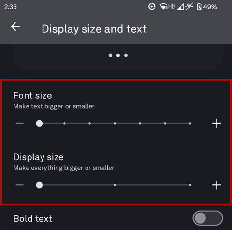

### Enabling Lock Screen

Referencing [my earlier analogy](#security-concerns) on the importance of securing your device, this will show you how to enable the lock screen on Android. If you are running Hybrid mode as well, I highly recommend that you disable the lock screen PIN on LightOS (if enabled) and use only the Android lock screen. This way the phone is secure but you don’t have to unlock both Android and LightOS. For Full Android Users, you will only need the Android lock screen.

1. In Settings, navigate to ‘Security’.

```
Settings > ‘Security’ > ‘Screen Lock’ / ‘Fingerprint’
```

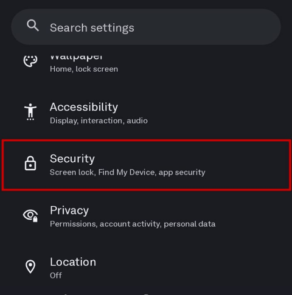

2. In ‘Security’, select ‘Screen Lock’ to enable a PIN or Pattern

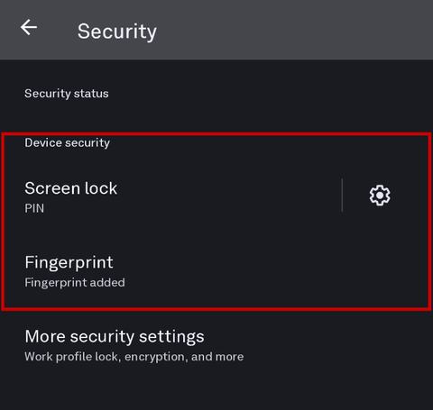

3. You also have the option to enable biometrics for the fingerprint scanner here as well.

### Notifications

This is especially applicable to those running in Hybrid Mode, although I use it as well in Full Android. The motor for the vibration on the Light Phone III isn’t great, so I’ll sometimes still miss important notifications, and there are some cases where I can’t have the ringer on, but still want to be notified of something on my phone. If you’re running Hybrid Mode and are missing key UI elements, such as the notification bubble, you may want to have the screen and/or flashlight flash to notify you.

1. In Settings, find ‘Notifications’.

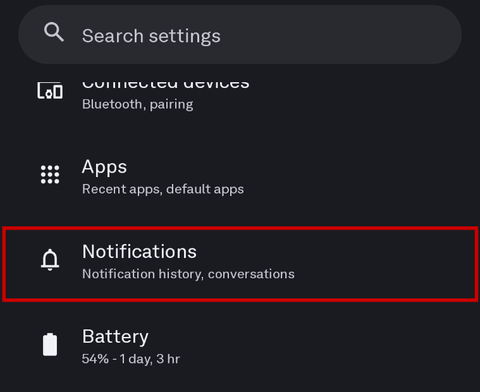

2. Find ‘Flash notifications’ and select it.

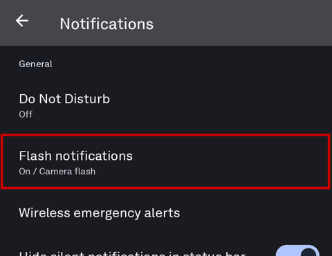

3. You’ll have the options to select ‘Camera flash’, ‘Screen flash’, or both.

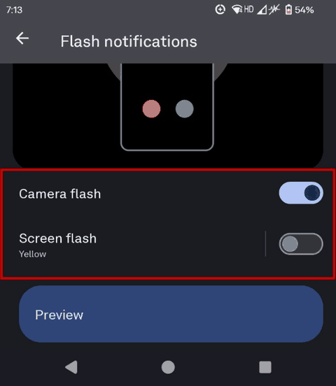

## Applications

This version of Android 14 runs completely de-Googled. This means that there are no Google apps pre-installed on the device. We are given a bare bones Android with basic functionality. In order to install more applications on the device, we’ll need to source the .apk from the developers and/or use a client.

### Clients

If you’re going to install applications, the most common way is through an app store. Aurora is an absolute must for the majority of people. For free and open-source software (FOSS) or open-source software (OSS), you have a few options to choose from.

Aurora is a FOSS (free and open-source software) client for the Google Play Store.

#### Aurora Store

For proprietary non-FOSS applications (i.e. Discord, Whatsapp, Apple Music, Spotify, etc.) you will need the [Aurora store](https://auroraoss.com/files). Anything that you would normally find on the Google Play Store will be here, however, there is no guarantee that it will work on the LP3. There is a [mega thread on r/ModifiedLightPhones](https://www.reddit.com/r/ModifiedLightPhones/comments/1qxejib/which_apps_work_on_the_light_phone_23_mega_thread/) that details some of the known applications that work on the LP3.

In this section, I’ll show you how to download Aurora Store via the device itself.

1. Navigate to the QuickStep home screen.
2. Find Chromium (or use the Google search bar) and open it.

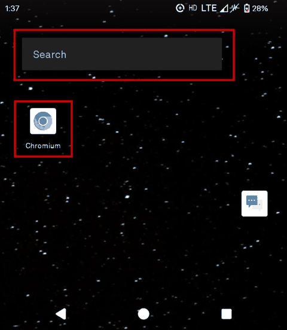

3. Search for ‘Aurora Store’ or type in the following link: [https://auroraoss.com/files](https://auroraoss.com/files)

a.Dir: / downloads / AuroraStore / Release

4. Download the latest .apk and wait for the download to finish. You can find the downloaded

file in the downloads tab within Chromium.

5. Tap on the .apk file.

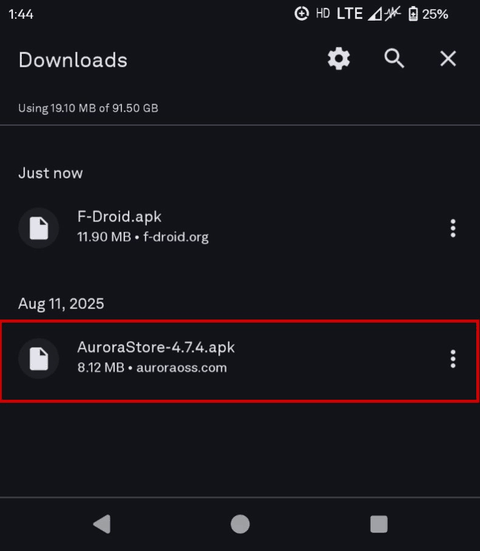

6. Open the .apk with ‘Package Installer’.

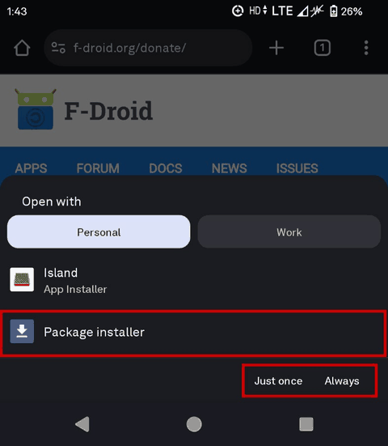

7. You will receive the following prompt saying Chromium ‘isn’t allowed to install unknown

apps from this source.’ Tap ‘Settings’.

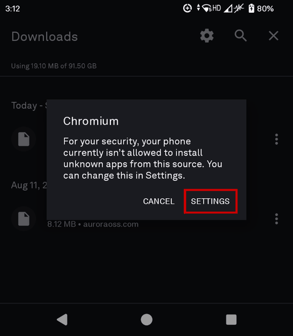

8. Enable Chromium to install unknown apps.

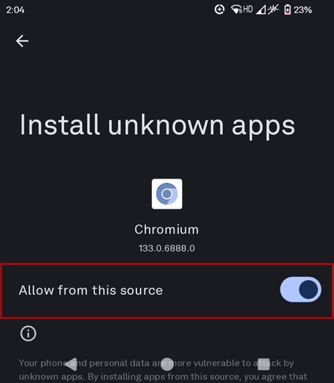

9. Let Aurora Store finish installing.

#### FOSS Clients

For free and open-source software (FOSS) or open-source software (OSS) apps and their respective repositories need to be sourced via an app store (see below), through Obtainium or downloading the .apk and installing through the default Android Package Installer.

FOSS/OSS repos can be sourced from the following store clients:

- [F-Droid](https://f-droid.org/en/)
- [Droidify](https://github.com/Droid-ify/client)
- [IzzyOnDroid](https://android.izzysoft.de/)
- [Accrescent](https://github.com/accrescent/accrescent)
- [Komi Store](https://github.com/kurikomi-labs/komi-store) (previously GitHub Store).

#### Obtainium

[Obtainium](https://obtainium.imranr.dev/) is not*absolutely*necessary but is incredibly useful in keeping applications updated that were sourced from the GitHub repos directly.

Developers will often push updates, fixes and releases to their GitHub repos without notifying existing users. Updates will typically be pushed to GitHub first before ending up on clients such as F-Droid. Sometimes applications can be updated via the client directly (even if downloaded from GitHub) but often, applications are not available on those repo clients.

All community-made tools for the LP3 are recommended to be downloaded via Obtainium as this will allow them to stay updated frequently as developers frequently push out new fixes and releases. A list of current community-made Light tools can be found [HERE](#general).

### Google

One of the things I mentioned earlier was that the phone does not come with anything Google made. Some applications require Google Framework Services to run and operate, some don’t. Anything in the Google Suite of applications will inevitably need microG (formerly known as revanced) to run. The only caveat to that is that microG will only work on the Light Phone III with minimal functionality. Without a root, you cannot use microG to it’s full extent. This is due to signature spoofing issues.

While running in Full Android, I did notice that I had encountered a bug with Google Framework Services. It was continuously crashing after ~4 hours and would reboot the phone. Uninstalled it, ran `logcat` to monitor and had no issues afterwards. You may not have issues, but it is something to keep in mind.

#### Google Framework Services

The .apk for Android 14 Google Framework Services can be found [here via APKMirror](https://www.apkmirror.com/apk/google-inc/google-services-framework/variant-%7B%22arches_slug%22%3A%5B%5D%2C%22minapi_slug%22%3A%22minapi-34%22%7D/).

The .apk for microG (formerly known as revanced) can be found [here via vanced](https://vanced.to/gmscore-microg). microG:

For the time being, it may be beneficial for you to look into FOSS applications in place of Google’s suite of applications since they can’t / won’t work correctly or to their full extent. You’re more than welcome to play around with Framework Services and microG to find a compromise to suit your needs.

### Launchers

Similar to LightOS’s React Native launcher app, Android also employs the use of launchers for their home screen. Home screen and launcher can be used interchangeably. You’re more than welcome to use the built-in QuickStep, however, I have a few launchers that are note-worthy and others that are not suitable for the Light Phone. At the end of the day, test out some of the launchers below to see if you like them.

#### Luma

Luma is a Kotlin-based Android launcher application that uses a fork of OlauncherCF inspired by inkOS. It takes inspiration from the aesthetic design of LightOS and implements other features that would be desired from Light Phone users.

Brief list of features, as noted in [this reddit post by vandamd](https://www.reddit.com/r/LightPhone/comments/1n6qkka/luma_lightos_styled_launcher/):

- Tiny file size (< 3 MB)
- Ability to rename applications
- Hiding apps from the app drawer
- Up to 5 pages on the home screen, where each page can have 1-6 applications
- Notification indicator (\*)
- Ability to show / hide page indicator as well as change alignment from left / right
- Gestures for actions (i.e. open app, show notifications, show recent apps, show quick

settings, etc.)

- Similar haptics as used in LightOS
- Similar font to LightOS (Public Sans)

I have nothing but kind words for Vandam. This launcher perfectly embodies the LightOS aesthetic but still retaining core user customisation that is not available in LightOS itself. For those who are into minimal launchers but love LightOS’s graphic design, this would be the first launcher I point them to for Android. On another note, it also works for other Android devices, not just the Light Phone.

Luma can be downloaded [here via GitHub](https://github.com/vandamd/Luma).

Locked down fork of Luma that prevents access to Luma settings. Requires keyboard combo CTRL + G to access settings.

##### Luma Strict

Luma Strict can be downloaded [here via GitHub](https://github.com/dav12072018/Luma).

Luma 2 is a dedicated launcher outside of Luma (1) that combines both LightOS tools and Vandam’s community tools. It implements a similar dashboard to Light’s ([https://dashboard.noscroll.ing/](https://dashboard.noscroll.ing/)). Through the dashboard, you are able to show LightOS tools, Vandam’s [No Scrolling tools](https://noscroll.ing/) and any other applications installed via the Android layer.

##### Luma 2.0

For privacy purposes, there is no email or password required but you will need to generate a 16 digit account ID.

Do keep in mind that this version of Luma is an early pre-release build. Bugs are to be expected as it is not a stable release build.

Brief list of features:

- Gesture actions on the lock screen
- Enabling dedicated keymaps
- Ease of switching between LightOS and the Android layer
- Both LightOS tools and Android apps will appear within the same home screen

launcher.

- Reduced battery consumption

Luma 2 can be installed via Obtainium by including pre-releases in additional options when installing or updating the main Luma app.

#### Before Launcher

Before Launcher is a minimal launcher app that is similar in nature to LightOS. It is designed to reduce distractions and help you use your phone less.

Brief list of features:

- Minimal homescreen with no ads
- Customise the look of the launcher
- Fast access to favourites and one swipe to access app drawer
- Favourites, folders and the ability to hide apps
- Hide unnecessary notifications
- Easy set-up
- Widgets
- Ability to remove anonymous analytics

Inititally, I used Before Launcher while following the [original modding guide](https://docs.google.com/document/d/1aDvuVqibzC8x0FpuHaJw5llYmERLgU8CwcEHg9hHZqc/edit?tab=t.0#heading=h.wb5q0wyzm1wb). It is a simple, minimal launcher with minimal permissions. It allows you to customize the home screen in more sleek and modern look, with the ability to add widgets at the top for time, date, weather, etc. You are able to view notifications on the home screen without needing to view the status bar.

Before Launcher can be downloaded via Aurora.

#### Olauncher

Olauncher is a minimal ad-free (AF) launcher with just enough features for functionality but to help keep the home screen as minimalist as possible.

Brief list of features:

- Minimalist homescreen with no ads
- Customisations that include resizing text, renaming apps, hiding unused apps, show

/ hide status bar, app text alignments, etc.

- Gestures including double tap to lock, swipe gestures, etc.
- Wallpaper customisation that can either be a new daily wallpaper or your own
- FOSS Android launcher that has no trackers via Exodus.

I found Olauncher to be a solid contender for the Android launcher, however, I found it had a weird aspect ratio and while the customisations are great, they are not optimised for the Light Phone and therefore you may have some issues getting it right for your own use case.

Olauncher can be downloaded via Aurora and F-Droid.

#### Square Home

Square Home is a tile-based launcher that takes massive inspiration from Microsoft 8’s tile UI, but easier to use. It can be used as minimally or as maximally as you wish.

Brief list of features:

- Vertical scrolling and horizontal scrolling from page to page
- Tile effects
- Shows notifications and count on tile
- Smart app drawer
- Customisation including but not limited to: tile colours, tile size, tile icons, tile

names, widgets, app folders, wallpapers, etc.

This is absolutely a love-or-hate-it kind of launcher. I found that it took the best of Microsoft 8’s tile UI and made it better, but I really had to keep an open-mind while trying it out. I didn’t mind using the launcher and I adored the amount of customisation that came with the launcher but ultimately moved away from it for my own use case.

Square Home can be downloaded via Aurora.

#### folder launcher

folder launcher is a file structure / directory inspired launcher.

Brief list of features:

- A minimal folder based launcher
- Widgets with customisable bounds
- App icon support
- App renaming
- Custom wallpaper support

I used folder launcher for a week or so and I believe it has potential, but doesn’t quite hit the mark for me. It is a simple, privacy-friendly and FOSS launcher that uses folders as its primary way of organising the home screen and navigating it. I enjoyed the customisation for apps, although there was a bit of a learning curve when it came to understanding the bounds of widgets. Swipe gestures were finicky, no app drawer available and navigating settings had a learning curve to it as well. I do greatly appreciate the nod to directory navigation. folder launcher can be downloaded via F-Droid.

#### Ion Launcher

Ion Launcher isn’t a minimal launcher but it can be customised to be one. It is designed as a beautiful, functional and customisable launcher.

Brief list of features:

- Shows only relevant information on the home screen and organises your apps in the

app drawer based on categories

- Customisation of the wallpaper, icons, app names and other settings
- Ergonomic where elements are arranged in a way that makes the phone optimal to

use for reachability and muscle memory

- Lightweight and fast, designed to take up as little storage as possible (within reason)

I used Ion Launcher only briefly. I liked the customisation of the launcher, apps and the home screen, however it is not optimised for the Light Phone III. I had some issues changing some of the customisation settings to make it more minimal, and thus, I ended up moving away from it.

Ion Launcher can be downloaded via F-Droid.

#### Niagara Launcher

Niagara Launcher takes a minimal launcher and makes it easily accessible with one hand and aims to reduce screen time.

Brief list of features:

- Ergonomic efficiency to use everything with one hand
- Adaptive list for important notifications such as incoming messages, calendar events

etc. and adjusts based on your usage

- Embedded notifications on the apps
- Ad-free
- Lightweight and fast
- Material You themes
- Personalisation and customisation with icon packs, fonts, wallpapers, etc.

I have not personally used Niagara but I have heard good things about it, especially in the market for minimal launchers.

Niagara Launcher can be downloaded via Aurora.

#### inkOS

inkOS is a text-based minimalist launcher that was optimised for Android-based devices as well as e-ink displays.

Brief list of features:

- Gestures for double tap, swiping, clock / date
- Top and bottom margin control
- Audio playing widget
- Date, clock and battery widgets
- Custom wallpaper
- System shortcuts
- App and notification drawers
- Notification icons on applications on home screen
- Multiple pages and user defined number of apps + reordering

inkOS was originally designed for the Mudita Kompakt but can be used on any Android device and has specific options for those using e-ink devices. It does not have infinite scrolling and I found the launcher to be a tad bit compact for the Light Phone, but other Light Phone users in the community praise it as an alternative to LightOS. inkOS can be downloaded [here via GitHub](https://github.com/gezimos/inkOS/releases).

### FOSS Alternatives

What do we do about the AOSP or missing applications that we may need on the Android side? You have the option to try and replicate any missing Google applications with the help of [this section](#obtainium), however, I want to also present another alternative – FOSS.

There’s quite a few apps that replace AOSP or Google-based system apps, as well as some others that you may not have realised were missing. My personal preference is to use the Fossify suite of applications although the Right suite of applications can be used too as both Fossify and Right are FOSS forks of the once FOSS Simple Tools suite of applications, all of which can be downloaded via F-Droid.

- Breezy Weather
- Weather by Vandamd
- CoMaps
- Fossify Calculator
- Fossify Calendar
- Fossify Clock
- Fossify Contacts
- Fossify File Manager
- Fossify Gallery
- Fossify Music Player
- FlorisBoard
- FUTO Keyboard
- HeliBoard
- MJ PDF (pdf viewer)
- Notesnook
- Open Camera
- Organic Maps
- Passes by Vandamd
- PipePipe (YouTube client)
- QUIK SMS or Fossify Messaging
- VLC (audio and media player)
- Right Dialer
- I use this as my dialer as it is the only dialer app that I could find that works with the Light Phone screen aspect ratio without breaking other apps and still retains the call UI.
- OsmAnd (maps)
- I do not personally use this as it has a large learning curve and is particular but does provide an alternative to Google Maps.
- Fossify Phone
- I used this on my smartphone, but unfortunately, it is not optimised for the Light

Phone. The general UI works except during calls where the icons for call functions are missing but can be changed with display font size.

### Additional Applications

Here I will share the necessary applications I use for functionality of the phone, whether in Hybrid or Full Android Mode. I have included lists of other apps I currently use on my Light Phone as well. I purposefully made it a point to keep the phone utility-based, despite running Full Android and having full capability of the phone. Can it run social media apps? Yes, but not well. I would recommend keeping the phone for utility only since the screen makes optimisation awful for the aspect ratio and in lacking a root for full microG support, it makes some applications behave weirdly. These are what I use or have used, but it’s entirely up to you with what you want to install and use.

#### Community-Made Light Tools

Following the release of the [Light SDK](https://github.com/lightphone/light-sdk), lots of developers are working on building their own tools for the community. This list includes tools included on the [awesome light website](https://awesome-light.garado.dev/) as well as other tools released by the community.

All community-made tools for the LP3 are recommended to be downloaded via [Obtainium](https://github.com/ImranR98/Obtainium) as this will allow them to stay updated frequently as developers frequently push out new fixes and releases.

##### Communication

- Molly Light (jabberbox)

`o` A DIY minimal LightOS-esque reskin of Molly (a hardened, open-source fork of

Signal). `o` [Source](https://github.com/jabberbox/molly-light) `o` [Download](https://github.com/jabberbox/molly-light/releases)

- Morse (vandamd)*UNRELEASED***

`o` A LightOS-esque reskin of the Beeper client for the Light Phone III. Supports

Signal, Telegram, WhatsApp and iMessage. Currently in development. `o` Source `o` Download

##### Entertainment

- Passatempo (tyshi00)

`o` A small games tool for LightOS, built with the Light SDK. Eight things to do:

Snake, Brick Breaker, Pong, Tic-Tac-Toe, Connect Four, Sudoku, Word Search, and Dice. Formerly called "Games" - renamed to Passatempo (Portuguese/Italian for "pastime"). Each game has a daily budget to prevent you from spending too much time on the device. `o` [Source](https://github.com/tyshi00/Light-Games-Passatempo) `o` [Download](https://github.com/tyshi00/Light-Games-Passatempo/releases)

##### General

- Unofficial Light Phone API/CLI/TUI (garado)

`o` An unofficial, community-maintained Python API and CLI/TUI for managing music, notes, podcasts, and tools on Light Devices. This was made by reverse- engineering the API endpoints from the official Light Dashboard. `o` [Source](https://github.com/garado/light) `o` [Download](https://github.com/garado/light/releases)

##### Keyboard

- Emojis (zacksimpson)

`o` An emoji picker for the LPIII. All Android 14 emojis are organised by category and searchable. Emojis can be copied to your clipboard and customised to show most recent or most used. `o` [Source](https://github.com/zacksimpson/emoji-tool) `o` [Download](https://github.com/zacksimpson/emoji-tool/releases)

- Keyboard (adam-weber)

`o` A clone of the Light Phone 3's built-in keyboard, for any app with optional auto-correct and voice dictation that are fully local on the device and private. Ability to swipe down to hide the keyboard. `o` [Source](https://github.com/adam-weber/light-keyboard) `o` [Download](https://github.com/adam-weber/light-keyboard/releases)

- Type (KEZO555)

`o` A faithful recreation of the Light Phone 3 keyboard built on [Keyboard by

adam-weber](https://github.com/adam-weber/light-keyboard/releases), as a system keyboard for any app. Includes additional languages: English, Hebrew, Spanish, French, German, Italian, Portuguese, Arabic, Mandarin (QWERTY pinyin), Dutch (QWERTY + Belgian AZERTY), Russian and Polish – each with its own layout and long-press accents. `o` [Source](https://github.com/KEZO555/Type) `o` [Download](https://github.com/KEZO555/Type/releases)

##### Launchers

- Luma (vandamd)

`o` A minimal launcher for the Light Phone III with configurable swipe + tap gestures, hide apps from drawer, rename apps, shortcut pinning. `o` See also:

- [Luma Strict](#before-launcher)
- [Luma 2.0](#before-launcher)

`o` [Source](https://github.com/vandamd/luma) `o` [Download](https://github.com/vandamd/luma/releases)

##### Music/Audio

- Bard (sjkornelsen)

`o` A minimalist, text-only audiobook player designed for the Light Phone III.

Includes local audiobooks, optional Libby loans, and optional RSS audiobooks into one calm Books screen and one consistent player interface. `o` [Source](https://github.com/sjkornelsen/bard/) `o` [Download](https://github.com/sjkornelsen/bard/releases)

- Echo (vandamd)

`o` A minimal Spotify client for the Light Phone III that requires Spotify to be installed locally on the device. `o` [Source](https://github.com/vandamd/echo) `o` [Download](https://github.com/vandamd/echo/releases)

- NTS Radio (vandamd)

`o` An app to play NTS Radio Live shows and Infinite Mixtapes. `o` [Source](https://github.com/vandamd/nts-radio) `o` [Download](https://github.com/vandamd/nts-radio/releases)

- Phono (jonathancaudill)

`o` An independent, minimal Spotify client for LightOS with less album art. Playback runs in-process via a patched fork of librespot (Rust). Metadata (search, library, albums, artists, playlists) uses the official Spotify Web API with your own developer-app credentials. Does not require Spotify to be installed locally on the device but does require a premium Spotify account. `o` [Source](https://github.com/jonathancaudill/phono) `o` [Download](https://github.com/jonathancaudill/phono/releases)

- Reverb (vandamd)

`o` A local music player for the Light Phone III with high resolution playback that allows you to like songs, create playlists and display song lyrics. `o` [Source](https://github.com/vandamd/reverb) `o` [Download](https://github.com/vandamd/reverb/releases)

- Tunes (dryane)

`o` A minimal music app for the Light Phone III with automatic music detection. `o` [Source](https://github.com/dryane/light-music) `o` [Download](https://github.com/dryane/light-music/releases)

##### Navigation

- Buses (vandamd)

`o` An app for the Light Phone III to track buses in the UK. Includes bus stop search and bookmarks, services and live timetable, live map of buses and available seat capacity. `o` [Source](https://github.com/vandamd/buses) `o` [Download](https://github.com/vandamd/buses/releases)

- Topographic (garado)

`o` An outdoor maps app for the Light Phone III powered by OpenStreetMap.

Includes map with layers for trails, road, topographic contours, waterways and labels, displays current GPS location with compass directional indictator, GPX routes for navigation and the ability to create and edit map markers from the map or manually. `o` [Source](https://github.com/garado/light-topographic/) `o` [Download](https://github.com/garado/light-topographic/releases)

- Logger (vandamd)*UNRELEASED***

`o` Route logger for the Light Phone III in development. `o` Source `o` Download

##### Camera/Photos

- Zero (vandamd)

`o` A camera app for the Light Phone III that fixes latency issue with the LightOS camera tool. Allows .jpg and .raw DNG output files, manual and auto exposure, composition grid, image preview after capture, optical image stabilisation (OIS), B&W image mode. `o` [Source](https://github.com/vandamd/zero) `o` [Download](https://github.com/vandamd/zero/releases)

- Photo Backup (sjkornelsen)

`o` A minimal back-up tool for the Light Phone III that discovers eligible photos and appends them to the connected user's Google Photos library. It has no gallery, thumbnails, previews, downloads, deletion, or Google Photos browsing. It works without Google Play Services. `o` [Source](https://github.com/sjkornelsen/light-photo-backup-public/) `o` [Download](https://github.com/sjkornelsen/light-photo-backup-public/releases)

##### Productivity

- Checklist (ak-nattyb)

`o` A simple checklist app with list-based organization for Light Phone users with

Markdown capability and colour inversion. `o` [Source](https://github.com/ak-nattyb/Checklist/) `o` [Download](https://github.com/ak-nattyb/Checklist/releases)

- Composer (zacksimpson)

`o` A notes tool for the Light Phone III with Markdown capabilities. `o` [Source](https://github.com/zacksimpson/composer-tool/) `o` [Download](https://github.com/zacksimpson/composer-tool/releases)

- Luminous Strategies (ak-nattyb)

`o` An app that lets you choose a card from Brian Eno's Oblique Strategies to inspire your creativity. `o` [Source](https://github.com/ak-nattyb/Luminous-Strategies/) `o` [Download](https://github.com/ak-nattyb/Luminous-Strategies/releases)

- Recall (ChopinDavid)*UNRELEASED***

`o` An Anki-compatible spaced-repetition client for the Light Phone III built with the Light SDK. Allows you to study you due Anki cards. Features deck creation, editing and browsing stay on the device `o` [Source](https://github.com/ChopinDavid/recall-lightos/) `o` [Download](https://github.com/ChopinDavid/recall-lightos/releases)

- Reminders (zacksimpson)

`o` A reminder tool for the Light Phone III that can organise tasks into lists, add due dates and times, check things off as you go and get notified when it matters. `o` [Source](https://github.com/zacksimpson/reminders-tool/) `o` [Download](https://github.com/zacksimpson/reminders-tool/releases)

##### Utility

- Backlog (Alexis-NM)

`o` A minimal, LightOS-inspired video game tracker for the Light Phone III — a stripped-down Backloggd experience. Track your games by status, rate them, browse by console, write them into custom lists, and read game descriptions & screenshots — all in a distraction-free black & white interface. Game data comes from IGDB (by Twitch). `o` [Source](https://github.com/Alexis-NM/light-backlog) `o` [Download](https://github.com/Alexis-NM/light-backlog/releases)

- Bible (cmg-ops)

`o` An offline Bible app for the Light Phone III with downloadable translations, bookmarks, saved verses and full-text search. `o` [Source](https://github.com/cmg-ops/LP3-Bible/) `o` [Download](https://github.com/cmg-ops/LP3-Bible/releases)

- Bible (greghare)

`o` A simple, distraction-free Bible reading app for the Light Phone III, with ESV text and audio, verse highlighting, search and optional light/dark mode. `o` [Source](https://github.com/greghare/light-bible/) `o` [Download](https://github.com/greghare/light-bible/releases)

- Botany (greghare)

`o` A plant identification tool for the Light Phone III: point it at a plant, snap a photo, and get its common name, scientific name, and family via the Pl@ntNet API. Save identifications to by adding plants to your Collection. Includes over 50,000 identifiable species and location field settings. `o` [Source](https://github.com/greghare/light-botany/) `o` [Download](https://github.com/greghare/light-botany/releases)

- Dictionary (garado)

`o` A simple offline dictionary app with word pronunciation and saving words for later review. `o` [Source](https://github.com/garado/dictionary/) `o` [Download](https://github.com/garado/dictionary/releases)

- Light GPSLogger (garado)

`o` A Light Phone III-style reskin of GPSLogger that logs GPS information to various formats (GPX, KML, CSV, NMEA, Custom URL) and has options for uploading (SFTP, OpenStreetMap, Google Drive, Dropbox, Email). `o` [Source](https://github.com/garado/light-gpslogger/) `o` [Download](https://github.com/garado/light-gpslogger/releases)

- Lists (cmg-ops)

`o` A DailyHobbyist tool built for the Light Phone III. Offline, expandable, infinitely nestable lists — every item can open into its own list, as deep as you want. `o` [Source](https://github.com/cmg-ops/LP3-Lists/) `o` [Download](https://github.com/cmg-ops/LP3-Lists/releases)

- MediLight (ruditimmermans)

`o` An Medication app that helps you keep track of your medications and remember to take them. All user data is stored locally on the device. `o` [Source](https://github.com/ruditimmermans/LightMedication/) `o` [Download](https://github.com/ruditimmermans/LightMedication/releases)

- Metronome (garado)

`o` A minimal metronome app for the Light Phone 3. Includes editable BPM with incremental adjustment buttons, downbeat emphasis, note subdivisons and haptic feedback. `o` [Source](https://github.com/garado/metronome/) `o` [Download](https://github.com/garado/metronome/releases)

- Nourish (zacksimpson)

`o` A mindfulness-first daily check-in tool and meal logger for the Light Phone III. `o` [Source](https://github.com/zacksimpson/nourish-tool/) `o` [Download](https://github.com/zacksimpson/nourish-tool/releases)

- Paka (janovsk1s)

`o` Offline pass wallet and TOTP authenticator for the Light Phone III. Stores barcodes, PDFs, document photos and 2FA codes locally on the device. Includes support for QR, Aztec, PDF417, Data Matrix, GS1 and linear barcodes. `o` [Source](https://github.com/janovsk1s/paka/) `o` [Download](https://github.com/janovsk1s/paka/releases)

- Passes (vandamd)

`o` An app for the Light Phone III to store and scan various codes including QR,

Aztec, EAN-13, EAN-8, PDF417, UPC-E, Data Matrix, Code 39, Code 93, ITF-14, Codabar, Code 128 and UPC-A. `o` [Source](https://github.com/vandamd/passes/) `o` [Download](https://github.com/vandamd/passes/releases)

- Pokey (jabberbox)

`o` A personal GLP-1 injection and weight tracker for the Light Phone III. Includes shot and weight logging, history, goal tracking, imperial and metric toggles and a 7-day countdown. `o` [Source](https://github.com/jabberbox/pokey/) `o` [Download](https://github.com/jabberbox/pokey/releases)

- Ritual (KEZO555)

`o` An AeroPress recipe guide for the Light Phone III. Includes browsing recipes by category, full brew specs and a brew timer. `o` [Source](https://github.com/KEZO555/Ritual/) `o` [Download](https://github.com/KEZO555/Ritual/releases)

- StopWatch (cmg-ops)

`o` A stopwatch tool for the Light Phone III that has laps, best/slowest lap tracking and a history of past sessions. `o` [Source](https://github.com/cmg-ops/LP3-StopWatch/) `o` [Download](https://github.com/cmg-ops/LP3-StopWatch/releases)

- Strings (garado)

`o` A minimal chromatic tuner for the Light Phone III with an adjustable reference pitch and adjustable note display. `o` [Source](https://github.com/garado/strings/) `o` [Download](https://github.com/garado/strings/releases)

- Tracker (tyshi00)

`o` A tiny health tracker for the Light Phone III — just a simple way to keep tabs on your water intake, sleep, steps, and (if it applies to you) your cycle, without any distractions. `o` [Source](https://github.com/tyshi00/Tracker/) `o` [Download](https://github.com/tyshi00/Tracker/releases)

- Verses (zacksimpson)

`o` A focused Bible reading tool for the Light Phone III, built with the official Light

SDK. Includes full access to any verse or passage, Verse of the Day, multiple translation support and add notes for reference. `o` [Source](https://github.com/zacksimpson/verses-tool/) `o` [Download](https://github.com/zacksimpson/verses-tool/)

- Weather (vandamd)

`o` A weather tool for the Light Phone III using the Open-meteo API. Includes current weather conditions, hourly and weekly forecasts, search and save multiple locations, customisable units between imperial and metric (temperature, precipitation and wind speed), current location support. `o` [Source](https://github.com/vandamd/weather/) `o` [Download](https://github.com/vandamd/weather/releases)

- Aegis (2FA) (via Aurora or F-Droid)
- KeePassDX / KeePassDroid (via Aurora or F-Droid)
- Ente Auth (via F-Droid)
- Bitwarden (via Aurora)
- NetGuard (via Aurora)
- Mullvad VPN (via Aurora or F-Droid)

#### Security and privacy

- Brave (via Aurora)
- Mozilla Firefox (alternatives include IronFox and Fennec) (via Aurora for Fennec or via

[GitHub](https://github.com/ironfox-oss/IronFox) for IronFox)

#### Internet

- Waze (works without Google Play Services but is owned by Google) (via Aurora)
- Spotify (via Aurora)
- HERE We Go (via Aurora)

#### Travel / Media

- Volume Styles (via Aurora) (primarily for Hybrid Mode)

#### Functionality (not optional)

- Key Mapper (via Aurora or F-Droid) (Hybrid and Full Android Mode)
- Macrodroid (via Aurora) (Necessary for Hybrid Mode, optional for Full Android)
- Signal
- Simplex (optional)
- Briar
- WhatsApp (via Aurora)

#### Communication

- Insular (fork of Island) (via F-Droid)
- Greenify (via Aurora)

#### Isolation

- Proton Mail
- Tuta Mail

#### Email

The isolation one is a bit strange. I currently run any of my apps that are known to track in a sandbox. I use Insular, which is a fork of Island, to enable work profiles on Android. This allows me to clone applications to a separate part of the phone where they can function normally, but don’t have access to anything on the ‘mainland’. This is for privacy purposes and completely optional.

## Key Maps and Macros

In Android, we initially lose the functionality of the hardware buttons and some of the general UI. In order to restore them, we’ll need to employ the use of Key Mapper and Macrodroid. While I don’t currently have a use for Macrodroid, I did end up using it heavily while test driving Hybrid mode. You’ll need macros in order to use Hybrid Mode effectively but in Full Android, it isn’t necessary unless you want it. Now, while running Full Android, I primarily use Key Mapper, especially for the fun key maps I’ve made.

### Key Mapper

This application is crucial in helping to restore button functionality while in Android. If you haven’t noticed, we can no longer use the buttons as they once were in LightOS

#### Installation

1. Install Key Mapper (via Aurora or F-Droid).

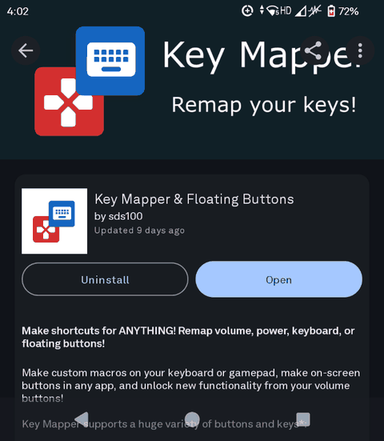

2. Open Key Mapper.
3. You’ll have the following warnings at the top of the screen:

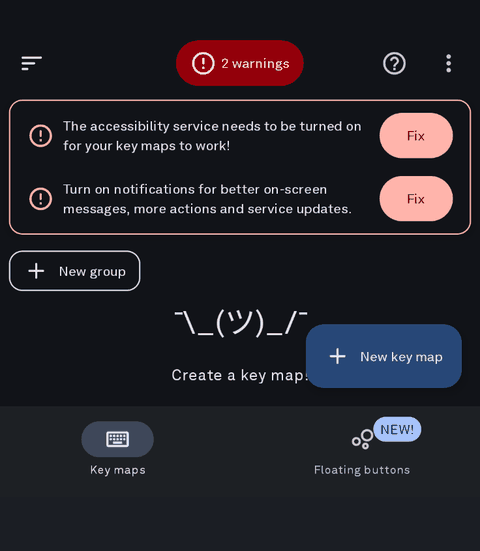

4. Enable accessibility services:

a. Select ‘Fix’.

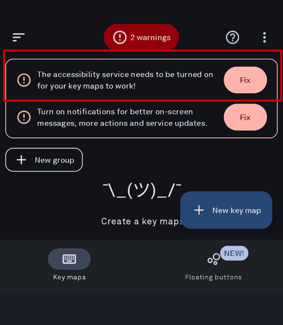

b. Select ‘Enable’.

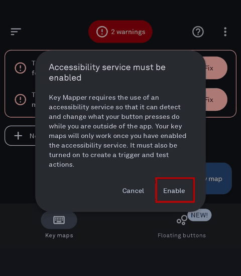

c. Make sure Key Mapper is ‘ON’ in Accessibility Settings.

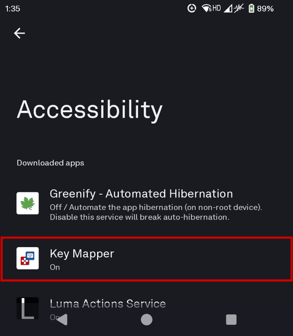

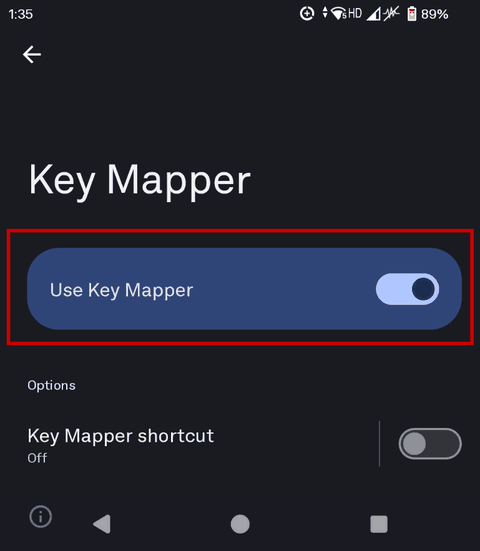

d. Go back to Key Mapper.

5. Turn on notifications:

a. Select ‘Fix’.


b. Select ‘Turn on’.

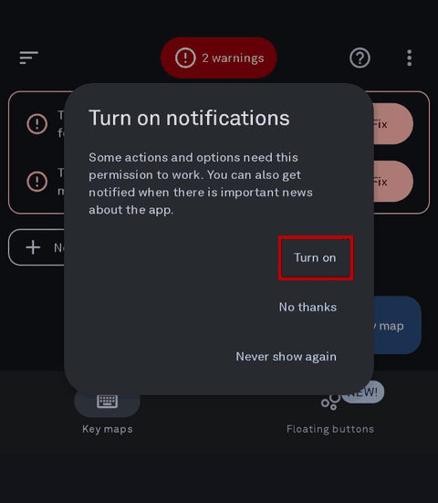

c. Select ‘Allow’.

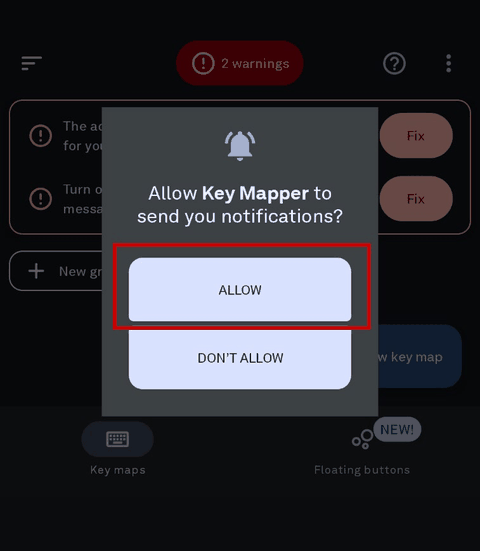

d. Go back to Key Mapper.

6. Verify Key Mapper is running.

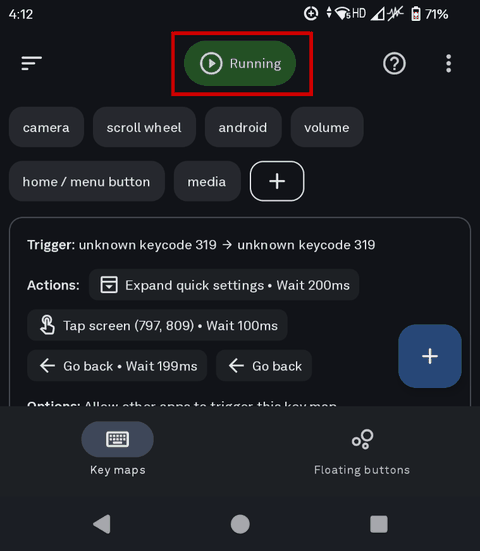

#### Creating Key Maps

There’s an abundance of ways you can map your keys, especially since the Light Phone III comes with additional hardware. You have free will and customisation for this, so feel free to try out and modify different key maps to see which ones fit your use case the best. I’ll also include the key maps to replicate LightOS’s buttons, and I’ll detail the key maps I currently run as well.

In order to make a key map, you’ll have to record a trigger, select the action you want, constraints and additional options. Note, some of the actions require root and/or Shizuku so we won’t be able to use them quite yet.

You can also organise your key maps via groups and sub-groups depending on how many key maps you have.

In this section, I’ll show you how to make a new key map, and while this will be for the flashlight button, it is applicable to any key maps you make. In LightOS, you use the scroll wheel button as a long press in order to activate the flashlight. When we access Android, we lose that functionality.

\* Note: Make sure your display and font size are at the smallest possible, otherwise you will not be able to record triggers for key maps. If you skipped this step, click [HERE](#display-and-font-size) to jump to the section explaining how to do so.

1. Create a new key map. You can find the ‘+’ button to add a new key map at the bottom of

the screen.

Creating key maps, re-creating LightOS flashlight button (example):


2. Select ‘Record trigger’.


3. Press the button you wish to map.

a. In this case, the original flashlight button (centre button of scroll wheel) is

‘unknown keycode 319’.


4. Below the registered key trigger, select radial button ‘Long press’.
5. From the top banner, select ‘Actions’.
6. Select ‘Add action’.


7. Find ‘Toggle flashlight’.


8. The flashlight brightness cannot be adjusted, so select ‘Done’.


9. If running in Hybrid mode, you’ll want to add the following constraint so your key maps

don’t interfere with LightOS: a. From the top banner, select ‘Constraints’. b. Select ‘Add constraint’.


c. Select ‘App not in foreground’


d. Find LightOS and select it.


10. Select ‘Done’ in the bottom right corner to finish and save your key map.


\* Note: some actions may not work unless you grant Key Mapper access to modify system settings.

1. Select ‘Fix’ on affected action.


2. Select ‘Fix’.


3. Allow Key Mapper to modify system settings.


#### Recreating LightOS Button Functionality

In this section, I’ll give you the key maps to recreate LightOS’s button functionality.

##### Scroll Wheel

Key map can be found [HERE](#creating-key-maps), used in the example on how to add a key map.

###### Flashlight

You will need to move the scroll wheel once. Delete all but one trigger (if there are multiple).

###### Increase Display Brightness

- Trigger(s): unknown keycode 318, short press
- Action(s): ‘Increase display brightness’, repeat until released (default settings)
- Constraint(s): ‘LightOS is not in foreground’ (Hybrid Mode only)
- Options: N/A

You will need to move the scroll wheel once. Delete all but one trigger (if there are multiple).

###### Decrease Display Brightness

- Trigger(s): unknown keycode 317, short press
- Action(s): ‘Decrease display brightness’, repeat until released (default settings)
- Constraint(s): ‘LightOS is not in foreground’ (Hybrid Mode only)
- Options: N/A

##### Volume

\* Note: Since the dialog box is part of the missing UI in Android due to `light_mode`, I highly recommend the app Volume Styles (via Aurora) if you’re running Hybrid Mode and can only map the volume keys for volume. If you are running full Android, the volume buttons will work normally, with a dialog box, without a key map.

##### Camera

\* Note: requires recording actions while creating a key map in Key Mapper.

This is a full depress of the camera button.

###### Open the Camera Application

- Trigger(s): Focus + Camera, short press at the same time
- Action(s): ‘Open Open Camera’
- Constraint(s): ‘LightOS is not in foreground’ (Hybrid Mode only)
- Options: N/A

This is a half depress of the camera button.

###### Focus

- Trigger(s): Focus, short press
- Action(s): ‘Tap: Lock exposure’
- Constraint(s): ‘LightOS is not in foreground’ (Hybrid Mode only)
- Options: N/A

This is a full depress of the camera button, while the camera app is open.

###### Take Picture

- Trigger(s): Focus + Camera, short press at the same time
- Action(s): ‘Tap screen (990, 547)’

`o` For this, I used a screenshot of the Open Camera app to determine the coordinates for the shutter button.


`o` You can also use the action ‘Interact with app element: ‘Take Photo’’

- Constraint(s): ‘Open Camera is in foreground’
- Options: N/A

##### Home

This is your menu / home button.

###### Go Home

- Trigger(s): Home, short press
- Action(s): ‘Go home’
- Constraint(s): ‘Device is unlocked’
- Options: N/A

#### Hybrid Mode Specific Key Maps

For this, I recreated the original key sequence to access Android that was patched in v474, that way I could still access Android without sacrificing my key maps for other navigation.

##### Android Access

- Trigger(s): Volume up → Volume up → Volume down → Volume down →

Volume up → Volume down → Home, in sequence

- Action(s): ‘Open [launcher app in Android’
- Constraint(s): ‘LightOS is in foreground’ (Hybrid Mode only)
- Options: N/A

Uses the centre scroll wheel button twice to act as your back button.

##### Go Back

- Trigger(s): unknown keycode 319, double press
- Action(s): ‘Go back’
- Constraint(s): ‘LightOS is in foreground’ (Hybrid Mode only)
- Options: N/A

Uses the home / menu button twice to open your recent apps. It will interact with media playback key maps (if you are using them) so you may need to choose a different button.

##### Recents

- Trigger(s): Home, double press
- Action(s): ‘Open recents’
- Constraint(s): ‘LightOS is in foreground’ (Hybrid Mode only)
- Options: N/A

#### Other Key Maps

- Trigger(s): Home, long press
- Action(s): ‘Show power menu’
- Constraint(s): ‘LightOS is in foreground’ (Hybrid Mode only)
- Options: N/A

##### Power Menu

##### Media Control

- Trigger(s): Volume UP, double press
- Action(s): ‘Next track’
- Constraint(s): ‘Media is playing’
- Options: N/A

###### Next Track

- Trigger(s): Volume DOWN, double press
- Action(s): ‘Previous track’
- Constraint(s): ‘Media is playing’
- Options: N/A

###### Previous Track

- Trigger(s): Volume UP, long press
- Action(s): ‘Fast forward’, repeat until released
- Constraint(s): ‘Media is playing’
- Options: N/A

###### Fast Forward

- Trigger(s): Volume DOWN, long press
- Action(s): ‘Rewind’, repeat until released
- Constraint(s): ‘Media is playing’
- Options: N/A

###### Rewind

- Trigger(s): Home, double press
- Action(s): ‘Play / Pause media playback’
- Constraint(s): ‘Media is playing’ or ‘No media is playing’
- Options: N/A

###### Play / Pause Media Playback

- Trigger(s): unknown keycode 318
- Action(s): ‘Volume up’, repeat until released
- Constraint(s): ‘Media is playing’
- Options: N/A

###### Volume UP

- Trigger(s): unknown keycode 317
- Action(s): ‘Volume down’, repeat until released
- Constraint(s): ‘Media is playing’

###### Volume DOWN

- Options: N/A

For this, any button will work although I used unknown keycode 319 (centre scroll wheel button). You’ll need to move colour correction to a spot on the notification shade so the key mapper can select it to enable / disable it.

##### Enable / Disable Colour Correction

This key map can also be used for other quick settings i.e. location, battery saver, data saver, night light, etc.

- Trigger(s): unknown keycode 319 → unknown keycode 319, in sequence OR

double press

- Action(s): ‘Expand quick settings’, wait 200 ms → ‘Tap screen: (797, 809), wait

100 ms → ‘Go back’, wait 200ms → ‘Go back’ `o` For this, I used a screenshot of the notification shade to determine the coordinates for the quick settings tile without opening the quick settings shade.


- Constraint(s): ‘LightOS is not in foreground’ (Hybrid Mode only)
- Options: N/A

### MacroDroid

Another nifty tool we can use to help use of the Android layer is macros. Macros allow you to automate certain functions with or without user input. There is a bit of a learning curve to adding and creating macros, and everyone’s use case is different, so there will be some trial and error depending on what you want the macros to do. It isn’t a necessity for Full Android users, since we have use of the missing UI elements, and don’t require switching between Android and LightOS. For Hybrid Mode users, you will have to rely on macros for certain functions.

For setting up macros, we will need MacroDroid. It has a 7-day free trial, which can be reset by uninstalling and re-installing the application. Any macros you make during this 7-day free trial will persist after the trial period is up and you can only make 5 on the free version.

There is the option to send the developer, Arlosoft, an email where you can pay via Wise. You will then receive a code that you can put into Macrodroid, granting you the pro version.

I need to make the point that I am not the best at making macros. I don’t use them in Full Android but I’ve included a few that I used for Hybrid Mode, as well as some community suggested ones as well. My focus was on Hybrid Mode for macros, and I tried to make them as simple and usable as possible.

Also, if MacroDroid asks for any permissions, grant it access.

#### Installation

1. Install MacroDroid (via Aurora).


2. Open MacroDroid.
3. Click through the initial set-up screen.
4. You will get a prompt for MacroDroid to send notifications. Select ‘Allow’.


#### Introduction to MacroDroid

MacroDroid is an expansive application that deserves its own standalone guide. There are so many ways to use it but I’ll give you the basic know-how to get started. How you use MacroDroid is completely up to you and your use case.

##### Home Screen


Starting with the home screen of MacroDroid, we have the following options:

- Add Macro
- Action Blocks

`o` Has videos for an

- System Log
- MacroDroid Videos

`o` How-to videos on how to introduction to action blocks and parameters.

- Forum
- Export / Import
- Variables

`o` Has videos for variables, use MacroDroid.

- Plugins

`o` Includes plugins for apps such as WhatsApp, Google applications, etc.

- Last Opened Macro
- Last Opened Action Block
- Favourite Macros
- Quick Run Macros
- User Log
- Auto Backup
- MacroDroid Drawer
- Quick Settings Tiles
- Categories
- Notification Bar Options

dictionary and array variables.

- Stopwatches
- Geofences

`o` Allows macros to run within location fenced areas.

- Cell Towers

`o` Uses location services to determine cell towers near the phone.

##### Templates

There is also a tab on the bottom banner for templates of user-made macros that you can use and/or modify to your own use case.


##### Creating Macros

When creating a macro, you have three blocks you can edit:

1. Triggers

a. These are what trigger a macro to start.

2. Actions

a. This is what you want the macro to do.

3. Constraints

a. There are any filters such as when and where you want the macro to run.


#### Hybrid Mode Specific Macros

Hybrid Mode comes with its own challenges since there is missing UI (due to `light_mode`) and the need to switch between LightOS and Android. The biggest issues come with notifications and call handling. Since `light_mode` will re-enable every time LightOS is opened, it’s not practical to continuously disable it via adb, so some workarounds will need to be made, through macros, to bridge the gap between Android and LightOS.

##### Call Handling

On of the biggest issues you may run into is call handling. Say you’re on the Android layer and begin to receive a call. You may hear ringing, you may see your screen or flashlight notifying you, but you are unable to see who is calling, answer or even decline the call.

For call handling in Hybrid Mode, there are a few different ways you can go about this depending on your use case:

1. [Dialog box on Android layer](#option-1-dialog-box)
2. [Immediate jump to LightOS](#option-2-immediate-boot-into-lightos)

When I ran Hybrid Mode, I preferred the dialog box. If I was doing something in Android, I wanted to be able to see who was calling me (despite the missing UI elements) and choose if I wanted to accept the call or not. I didn’t much prefer the immediate opening of LightOS if I was in the middle of a text, for example.

This option requires a bit of prior knowledge for if-then-else statements otherwise known as conditional statements. Simply put:

###### Option 1: Dialog Box

We want the macro to recognise the phone is ringing, in this case, it would be ‘Call Incoming’ and give us an option to accept or decline the call. If we accept the call, it will boot us into LightOS and accept the call for us (so we can reduce redundant inputs) or, if we decline the call, it will reject it for us. We also want it to only appear in Android. It’s a rudimentary set-up but effectively works since Hybrid Mode is missing the AOSP notifications.

```
if x is true, then [do this]; else (where x is false) [do this]
```

So, a basic pseudocode of this would be:

```
if LightOS = not in foreground:
if Call_Incoming = Any_Number then:
show Dialog_Box with options (Accept, Decline)
if Dialog_Box = confirmed then:
Launch LightOS & Answer_Call
else:
Reject_Call
```

1. Select ‘Add Macro’.

###### Trigger


2. In the ‘Triggers’ box, select the ‘+’ to add a trigger.


3. Select ‘Call / SMS’.


4. Select ‘Call Incoming’.


5. Select ‘Allow’ so that MacroDroid can access phone call logs.


6. Select ‘Allow’ so that MacroDroid can manage phone calls.


7. Select ‘Any Number’ and press ‘OK’.
8. In the ‘Actions’ box, select the ‘+’ to add an action.

###### Actions


9. Under ‘Conditions / Loops’, find and select ‘If Confirmed Then’.


10. You will receive a prompt stating MacroDroid ‘Requires Draw Overlays’. Select ‘OK’.

a. This will allow the dialog box to appear on the Android side.


11. Find MacroDroid in ‘Display over other apps’.


12. Enable ‘Allow display over other apps’.


13. Go back to MacroDroid and re-select ‘If Confirmed Then’.
14. In the prompt, you need to change the dialog title and dialog message. For these to show

who’s calling and the number associated with the caller, select {call\_name} and {call\_number} from the ‘…’ on the right.


15. Your dialog prompt should look similar to the one below.


16. Select ‘OK’ once you’re happy with how the text will appear on the dialog box.
17. Select ‘End If’.


18. Select ‘Add action above’.

a. This will add an action to the if-then-else statement that we just created.


19. Under ‘Applications’, find and select ‘Launch Application’.


20. Select ‘Select Application’ and ‘OK’ and find LightOS in your applications.


21. Select LightOS.
22. For Launch Options, make sure no options are selected and select ‘OK’.


23. Select ‘End If’.


24. Select ‘Add action above’.


25. Under ‘Phone’, select ‘Answer Call.’


26. For the delay, select ‘No Delay’ and then select ‘OK’.


27. Select ‘If Confirmed Then’.


28. Select ‘Add else clause’.


29. Select ‘End If’.


30. Select ‘Add action above’.


31. Select ‘Reject Call’.


32. In the ‘Constraints’ box, select the ‘+’ to add a constraint.

###### Constraints


33. Under ‘Device State’, find and select ‘Application Running’.


34. You will be given a prompt requiring usage access. Select ‘OK’.


35. Find and select MacroDroid.


36. Enable ‘Permit Usage Access’.


37. Go back to MacroDroid and re-select ‘Application Running’.
38. Select ‘Not in foreground’ and select ‘OK’.


39. Select ‘Use Either Mechanism’ and select 'OK’.


40. Select ‘Select Application(s)’ and select 'OK’.


41. Find and select LightOS and select ‘OK’.


42. Finish by adding a name to the macro and saving it.


With the macro complete, you’ll be able to accept calls and interact with the call in LightOS, or decline it, without needing to be in LightOS. Here is an example of the dialog box in use:


This is another option that follows the [original modding guide](https://docs.google.com/document/d/1aDvuVqibzC8x0FpuHaJw5llYmERLgU8CwcEHg9hHZqc/edit?tab=t.0#heading=h.wb5q0wyzm1wb) but shows you how to set it up. This will immediately boot you into LightOS if you’re on the Android layer if you are receiving a call.

###### Option 2: Immediate Boot into LightOS

1. Select ‘Add Macro’.

###### Trigger


2. In the ‘Triggers’ box, select the ‘+’ to add a trigger.


3. Select ‘Call / SMS’.


4. Select ‘Call Incoming’.


5. Select ‘Allow’ so that MacroDroid can access phone call logs.


6. Select ‘Allow’ so that MacroDroid can manage phone calls.


7. Select ‘Any Number’ and press ‘OK’.
8. In the ‘Actions’ box, select the ‘+’ to add a new action.

###### Actions


9. In ‘Applications’, find and select ‘Launch Application’.


10. Select ‘Select Application’ then ‘OK’.


11. Find LightOS in your applications.
12. For Launch Options, unselect all options and then select ‘OK’.


13. Add a name to your macro and save it.


##### Notification Handling

Notification handling is another issue we run into. With `light_mode` active, Hybrid users will lose key missing UI elements such as call UI, notification pop-ups, etc. We want our notifications to appear for us with the option for them to also appear on LightOS so we don’t miss anything important (i.e. WhatsApp messages).

For notification handling in Hybrid Mode, there are a few different ways you can go about this depending on your use case and familiarity with macros, but the following has been tested and working:

###### Simple Overlay

For this version of notification handling, the goal is for MacroDroid to recognise a notification and display an overlay box for us to be able to see it. We should be able to clear it ourselves or have it disappear after a set time. We won’t be able to open the app, but we should be able to see the notification and go from there.

SIMPLE OVERLAY

1. Select ‘Add macro’.

###### Trigger


2. In the ‘Triggers’ box, select the ‘+’ to add a trigger.


3. Under ‘Device Events’, find and select ‘Notifications’.


4. Select ‘Notification Received’ and then select ‘OK’.


5. For applications, you have the option to select certain applications or all. This depends on

your particular use case.


6. For additional options, I left it as the default but you’re welcome to edit these if you wish.

Once done, select ‘OK’.


7. Your trigger should look like one of the following:


8. In the ‘Actions’ box, select the ‘+’ to add an action.

###### Actions


9. Under ‘MacroDroid Specific’, find and select ‘Overlay Bar’.


10. You’ll be given a prompt with all of your options. It will initially be empty. For this, we

want the application, the title and the text of the notification to appear. You can find the options in the ‘…’ on the right.


11. After adding the information you want to display, it should look something like this:


12. You can also change the background colour, text colour and overlay position.

a. I opted for a grey or dark grey background at 13% transparency. b. White text for high contrast. c. Position at < 25% (this determines how high on the screen it will appear).


13. Verify ‘Show as Overlay’ is true.


14. At the bottom of the prompt, select ‘Add Action Button’.


15. Change the label to say ‘Clear’ and select ‘Clear notification on press’.


16. Select ‘OK’ when finished.
17. In the ‘Actions’ box, select the ‘+’ to add another action.


18. Under ‘Macros’, find and select ‘Wait Before Next Action’.


19. On the ‘Delay Period’ prompt, select how long you want the overlay to stay on the screen. I

opted for 10 seconds. Unselect ‘Use alarm’ at the bottom and select ‘OK’.


20. In the ‘Actions’ box, select the ‘+’ to add another action.


21. Under ‘MacroDroid Specific’, find and select ‘Clear MacroDroid Dialog’.


22. Your actions box should look like this:


Testing out the overlay:


Now, we can add the constraints to make sure they appear in LightOS as well.

23. In the ‘Constraints’ box, select the ‘+’ to add an action.

###### Constraints


24. Under ‘Device State’, find and select ‘Application Running’.


25. Select ‘Running in foreground’ and then select ‘OK’.


26. Select ‘Use Either Mechanism’ and then select 'OK’.


27. Select ‘Select Application(s)’ and then select ‘OK’.


28. Find and select LightOS in your applications and then select ‘OK’.


29. Repeat steps #23-#28 for ‘Not in foreground’.


30. On the main screen, change the logic gate to ‘OR’

a. This is so the notification will appear in both LightOS and the Android layer.


31. Name and save your macro.


## Hybrid Mode

\* Update: the [Light SDK](https://github.com/lightphone/light-sdk) is now available. This enables the option for user-installed applications outside of LightOS to populate in LightOS instead of needing a separate launcher and a way to swap in-between the Android layer and LightOS. For those that wish to do so, please follow the guide in the [SDK section](#tool-library).

Hybrid Mode is a use case for those who wish to use LightOS but require some additional applications for them to make a complete switch to the phone. There are some key differences between Hybrid Mode and Full Android, most notably with battery consumption and battery life, as well as use cases.

LightOS will always be running unrestricted in Hybrid Mode. This allows you to switch between the Android layer and LightOS seamlessly but, having multiple applications open at once and running in the background will drain your battery fairly quickly. Having Battery Saver on helped some, but it won’t do much in the case of Hybrid Mode users. You do have the option of restricting and/or optimising some of your Android layer applications to help conserve battery life, but the downside is that you may miss key notifications from i.e. messaging applications. Your battery life won’t be good, and unfortunately, there isn’t much that can be done about it.

Another thing to note, `light_mode` will always be enabled whenever you access LightOS. `light_mode` is simply one of the global setting that hides some of the missing UI elements i.e. call

UI, notification UI, status bar and button navigation. You can opt to enable it via adb or Shizuku/aShell but whenever you open LightOS again, it will disable it.

If you want to have full access to Wi-Fi / Bluetooth connections, you MUST enable `light_mode` in order to connect Bluetooth and Wi-Fi on Hybrid Mode. Click [HERE](#global-setting-light_mode) to enable

```
light_mode.
```

To run Hybrid Mode successfully, you may want to opt to keep your Android layer presence to a minimum to conserve battery life and you’ll need some Hybrid Mode specific additions to help usability.

For Hybrid Mode, you will want to follow the guide in this order:

1. [How to Access the Android Layer](#how-to-access-the-android-layer)
2. [Developer Options (Android and / or LightOS)](#android)
3. [Setting Up Android](#default-applications)
4. [Key Mapper](#isolation)

Everything else in this guide is meant for you to tailor to your own use, and trying out launchers, applications, keyboards, etc. is encouraged to all users. I can give some recommendations, but there is so many apps, key maps and macros that can all be customised to your own preferences.

You can click the links below to jump to some of the other Hybrid Mode Specific sections of this guide:

[Applications](#applications)

[Launchers](#luma)

[MacroDroid](#installation-1)

[Additional Applications](#foss-alternatives)

[Hybrid Mode Specific Macros](#hybrid-mode-specific-macros)

[Key Mapper](#isolation)

[Call Handling](#creating-macros)

[Recreating LightOS Key Maps](#open-the-camera-application)

[Notification Handling](#notification-handling)

[Hybrid Mode Specific Key Maps](#power-menu)

[Battery Optimisation](#amoled-display)

## Full Android

I will always emphasize the use of Full Android mode in terms of customisation, user functionality and battery life. Without LightOS running, you won’t have an additional app constantly running in the background and draining the battery further. You have more ability to customise the phone to your use case without Light being involved.

For Full Android, you will want to follow the guide in this order:

1. [How to Access the Android Layer](#how-to-access-the-android-layer)
2. [Developer Options (Android and / or LightOS)](#android)
3. [Setting Up Android](#default-applications)
4. [Key Mapper](#isolation)

Everything else in this guide is meant for you to tailor to your own use, and trying out launchers, applications, keyboards, etc. is encouraged to all users. I can give some recommendations, but there is so many apps, key maps and macros that can all be customised to your own preferences.

Before starting, I want to stress the importance of following this section’s directions to enable Full Android mode in order and understand the instructions fully. Re-iterating my warning from the preface:

In terms of liability, I am not liable if you mess up and/or brick the device. I have tried to make this as idiot-proof as possible to minimise the risks involved, but if you do something wrong, I am not at fault for it. There is a risk to modding a phone, especially in terms of jailbreaking or even delving into the lower levels of the API.

IF you do not understand the more advanced parts of this guide, do NOT attempt them. If you do not have an understanding of what you are doing, you are far more likely to break something.

Additionally, per [this comment from Joe Hollier via Reddit](https://www.reddit.com/r/LightPhone/comments/1jxtw0j/comment/mpvx94e/), Light deems use of the Android layer that results in a bricking or breaking the device as voiding the warranty of the phone. Know the risks involved and proceed with caution.

Once you understand the risks involved, we can get started.

### Global Setting: light_mode

I highly recommend you change `light_mode` first, before disabling LightOS. There seems to be a couple of issues enabling `light_mode` once LightOS is disabled. The most reliable way is via Change Launcher in LightOS developer settings, but I will include the adb commands for it as well.

#### What is light_mode?

`light_mode` is a global setting that hides certain UI elements i.e. heads up notifications, call UI, status bar and button navigation. If you’re going Full Android, you will absolutely want this setting enabled (disabled via LightOS) so you don’t need specific macros to see these elements and be able to interact with them like a normal Android device.

For Hybrid Mode users, this is necessary for enabling Bluetooth pairing and adding, as well as some Wi-Fi connections.

#### Change Launcher

If you haven’t already, enable LightOS developer options. You can find instructions on how to do so [HERE](#in-lightos).

\* Note: ‘Change Launcher’ is only able to be accessed through LightOS Developer Options. As of [Firmware v.1.440000](https://support.thelightphone.com/hc/en-us/articles/360031105751-Software-Versions-Change-Log), access to LightOS Developer Options is no longer possible as the factory version is now reverted to v52x or higher. If you have already enabled LightOS Developer Options prior to Firmware v1.440000, you will still be able to access these settings.

1. In LightOS settings, find and select developer options.


2. Find and select ‘Change Launcher’.

a. This will reboot the phone to Android.


3. You will then be prompted to change your default home app to the one of your choice.
4. Once fully booted into Android, you should be able to see the status bar.
5. Go ahead and change your other default apps to AOSP or any alternative applications

you like as well as changing navigation if you wish. a. You can click [HERE](#default-applications) to jump to ‘Default Applications’ if you are unsure of how to do so. b. You can click [HERE](#gesture-navigation) to jump to ‘Gesture Navigation’, if you are unsure of how to change navigation settings.

#### ADB

What you will need:

- Light Phone III
- Computer with adb OR Shizuku/aShell installed

`o` To set up adb, you can click [HERE](#disabling-lightos) for SDK adb or [HERE](#adb-via-shizukuashell) for Shizuku/aShell

Running the following command will list all global settings, which should include `light_mode`:

```
/adb shell settings list global
```


We’re looking for the following global setting:


1. Run the following command in adb:

a. Note that running the command will not output any results.

```
/adb shell settings put global light_mode 0
```


2. We can also run the following command to verify `light_mode` is 0:

a. Running any `get` command will output the current setting.

```
/adb shell settings get global light_mode
```


3. Reboot adb.

a. This will reboot the phone.

```
/adb reboot
```


### Disabling LightOS

What you will need:

- Light Phone III
- Computer with adb OR Shizuku/aShell installed

`o` For adb:

- You can download Android SDK [HERE](https://developer.android.com/tools/adb) either as part of SDK manager or as

the standalone Android SDK Platform Tools package. `o` For Shizuku/aShell

- You can find the installation process and use [HERE](#adb-via-shizukuashell) in the modding guide.
- Reliable USB connection

`o` If using adb on a computer, I recommend using the braided Light Phone USB-C cable that came with your phone if you have a USB-C data port or a simple USB-C to USB-A cable.

#### ADB via Android SDK

What you will need:

- Light Phone III
- Computer with adb
- Reliable USB connection

1. Connect your Light Phone III to your computer via USB.
2. In the notification shade, you should have a notification showing the device is connected

via USB.

3. Tap the notification for more options.

##### On Android


4. Verify the USB preferences are as follows:

a. USB controlled by: *This Device*


b. Use USB for: *No data transfer*


5. Navigate to Settings.
6. Find and select ‘System’.

```
Settings > System > ‘Developer Options’ > ‘USB Debugging’
```


7. Find and select ‘Developer Options’.


8. Find and select ‘USB Debugging’.

a. We need this enabled in order for the phone to be recognised by your computer.


9. In the prompt, select ‘OK’ to allow USB debugging.


10. In the next prompt, you should see the RSA key for your computer. Select ‘Allow’.


##### On Computer

I’m using the standalone SDK platform tools for Windows. If you are using the SDK manager or on Linux/Apple, your screen may be different but the adb commands are the same/similar.

```
11.  Unzip platform-tools-latest-xxx.zip
```

a. I opted to unzip it to my C: drive under /Program Files/

12. Locate your unzipped platform-tools and open the folder.


13. Right click anywhere outside of the files in the folder and select ‘Open in Terminal’.


14. To test whether or not your computer recognises the Light Phone III, type the following

command:

```
/adb devices
```


If the device is not showing up, verify USB debugging is enabled and you allowed the computer access to the phone.

15. Running the following command will list all of the packages on the device.

```
/adb shell pm list packages
```


16. We are looking for the following packages associated to LightOS:

```
com.lightos
```

```
com.lightos.utilities
```

```
com.lightos.certmanager
```

```
com.lightos.speech
```

```
com.lightos.fota
```


17. Now run the following commands to disable these packages:

```
/adb shell pm disable-user com.lightos
/adb shell pm disable-user com.lightos.certmanager
/adb shell pm disable-user com.lightos.fota
/adb shell pm disable-user com.lightos.speech
/adb shell pm disable-user com.lightos.utilities
```

18. We can verify these packages by running the following command:

```
/adb shell pm list packages -d
```


19. Reboot adb.

a. This will reboot the phone.

```
/adb reboot
```


20. Once completed, you can verify LightOS and its associated packages are disabled in

```
Settings > Apps > All Apps
```

a. If an application says ‘Enable’ that means it has been disabled.


#### ADB via Shizuku/aShell

Shizuku used in conjunction with aShell will allow you to run adb commands without the need for a computer. This is also used to run certain root/ADB hack commands for Key Mapper and MacroDroid.

Shizuku will act as the adb package and aShell will act as your terminal.

What you will need:

- Light Phone III
- Shizuku (via Aurora) or via browser [HERE](https://shizuku.rikka.app/download/).
- aShell (via F-Droid) or via GitHub [HERE](https://github.com/DP-Hridayan/aShellYou).
- Wi-Fi connection

1. Open Shizuku.

##### Shizuku

2. We want to use the option ‘Start via Wireless Debugging’ for Android versions 11+

a. You can find the step-by-step guide [HERE](https://shizuku.rikka.app/guide/setup/#start-via-wireless-debugging) for pairing.


3. Once Shizuku is paired, go ahead and start Shizuku


4. Once Shizuku is running, open aShell.
5. Find the tab that says ‘Permissions required’ and select ‘Request Permission’.

##### aShell


6. Allow aShell to access Shizuku.


7. Now, select ‘Start’.


8. Here you will see a screen with a command box. You may need to hide the keyboard to

fully see it. a. We don’t have a way to test if adb recognises the device like we would on SDK.

\* Note: unlike SDK, we do not need to place a ‘/’ in front of adb, the ‘#’ at the beginning of the command box replaces the ‘/’.

9. Running the following command will list all of the packages on the device.

```
adb shell pm list packages
```


10. We are looking for the following packages associated to LightOS:

```
com.lightos
```

```
com.lightos.utilities
```

```
com.lightos.certmanager
```

```
com.lightos.speech
```

```
com.lightos.fota
```


11. Now run the following commands to disable these packages:

```
adb shell pm disable-user com.lightos
adb shell pm disable-user com.lightos.certmanager
adb shell pm disable-user com.lightos.fota
adb shell pm disable-user com.lightos.speech
adb shell pm disable-user com.lightos.utilities
```

12. Once completed, you can verify LightOS and its associated packages are disabled in

```
Settings > Apps > All Apps
```

a. If an application says ‘Enable’ that means it has been disabled.


### Enabling LightOS

Should you decide to enable LightOS at any point either for firmware updates or would like to go back to LightOS, you’ll need to run the following commands:

```
adb shell pm enable com.lightos
adb shell pm enable com.lightos.certmanager
adb shell pm enable com.lightos.fota
adb shell pm enable com.lightos.speech
adb shell pm enable com.lightos.utilities
```

These commands can be run in SDK or Shizuku/aShell.

### Full Android without ADB

There is a workaround for you folks that want to go Full Android without the full commitment to disabling LightOS either through SDK or Shizuku/aShell. The only real way to achieve this is by going through `Settings > Apps > All` `Apps` and selecting ‘Force Stop’ on LightOS.

The ‘Force Stop’ should persist through reboots and will run minimally in the background. I don’t recommend this option since LightOS will still be running in the background and will continue to search for updates and/or syncing if that is still enabled. There is also the possibility for random crashes and reboots to still occur with LightOS enabled but force stopped. While I don’t recommend this option, I still leave it available to whomever may want it.

### Global Settings: Other

Since LightOS Developer Options are not accessible as of November 2025, I managed to find some additional settings that MAY be useful in restoring missing UI elements. This is due to `light_mode` not being the end-all be-all setting for restoring these settings. This includes, status bar, navigation bar, notifications, etc.

Using the previous section for `light_mode`:

1. Run the following command in adb:

a. Note that running the command will not output any results.

```
/adb shell settings put global light_mode 0
```


2. We can also run the following command to verify `light_mode` is 0:

a. Running any `get` command will output the current setting.

```
/adb shell settings get global light_mode
```


This will restore functionality within Full Android mode.

## SDK

Following the release of the [Light-SDK on GitHub](https://github.com/lightphone/light-sdk), this section serves as a guide to enable additional tools within LightOS. Hybrid Mode has effectively been replaced although, should you wish to continue using or prefer Hybrid Mode, the option is still available and can be enabled [here](#hybrid-mode).

The software development kit (SDK) serves multiple purposes for the LP3:

- Light internal development for things like a reworked Camera tool and keyboard

for optimisation and new features.

- Allowing the community to create their own dedicated Light tools for the LP3.
- Separate tools, instead of the singular LightOS .apk with individual modules.

`o` Currently, all tools are modules within the single LightOS app.

Unfortunately, if one thing is changed, something else may break. `o` Separating tools prevents LightOS from breaking in unexpected ways. `o` Allows secure third-party contributions.

You can read more about the SDK and what prompted the changes in the [Light Developer Program - June Update](https://us9.campaign-archive.com/?u=edd76eb62ae39ab4aea07bf69&id=1d6ec7eff3).

There are a multitude of benefits following the release of the SDK, as noted in [this release page](https://www.lightphonethings.com/):

- Design elements library

`o` Open-source UI/UX library of application components built around Jetpack

Compose. `o` Ensures uniformity across all tools regardless if they’re made by Light or the community.

- Push notification support

`o` Push notifications, if supported, will be routed through the UnifiedPush

Distributor and Light’s servers so notifications can populate within LightOS. `o` This includes support for external tools as well.

- Media access

`o` With user permission, tools can be built around their audio, video, images and other files with encrypted APIs for sending and receiving data with LightOS.

### Tool Library

The LightOS Tool Library is a way for users to browse and use a collection of vetted, user- created tools directly from the Dashboard. These tools are ones that the community submitted and Light approved.

\* Note: This is for users who either don’t want to install external tools/apps, use only Light- approved tools or simplify the tool installation process – it’s through the Dashboard, so the process will be largely the same as adding tools to your LP3 already.

The process of submitting your own tools should begin in August 2026.

[Light plans to release a tool library for the LP3 in September/October 2026](https://www.reddit.com/r/LightPhone/comments/1ulolc2/comment/ov6exsn/). It was one of the [suggestions I had made](https://www.reddit.com/r/LightPhone/comments/1pk4g9w/comment/ntokyjb/?screen_view_count=1) to Joe back in December 2025, with a [confirmation in March 2026](https://www.reddit.com/r/LightPhone/comments/1rqk4mk/comment/oa2h9kt/), prior to the SDK release. I’m both really excited for one of my suggestions to have been implemented and to see what it’s like when it comes out!

New tools built with the Light SDK and available with [the v568 update](https://support.thelightphone.com/hc/en-us/articles/360031105751-Software-Versions-Change-Log) include the Weather tool and Authenticator tool. These are separate .apks and NOT included within the main LightOS app.

### For Developers

For those who wish to create their own tools for the LP3, the [Light-SDK on GitHub](https://github.com/lightphone/light-sdk) will walk you through the process of creating your own application source code, running it on the [LightOS Emulator](https://github.com/lightphone/light-sdk/blob/main/sdk/emulator) with [instructions on how to run the emulator](https://github.com/lightphone/light-sdk/tree/main/docs/system_app), and further examples of Light’s newly released [Authenticator tool](https://github.com/lightphone/light-sdk/tree/main/examples/authenticator) and [Weather tool](https://github.com/lightphone/light-sdk/tree/main/examples/weather) that were released in v568. It’s recommended to have familiarity with [Android Studio](https://developer.android.com/studio), as well as knowledge of Kotlin, Compose, Coroutines and MVVM architecture but is not required. If you want to vibe code your way through a tool with Claude, you’re more than welcome to.

### Installing External Tools

What you will need:

- Light Phone III
- Keyboard (either wired USB-C connection or wireless)
- A personal computer

1. Navigate to the [Light Phone Dashboard](https://dashboard.thelightphone.com/) and sign-in.

#### In Light Account Dashboard

2. On the dashboard, select ‘Phone’.


3. Under the selected device, select ‘Settings’.


4. In ‘Settings’, verify your default location and select the toggle for ‘Developer Mode’

- This enables Developer Mode on LightOS


1. In LightOS Settings, select ‘Developer’.

#### In LightOS


2. Verify ‘all tools’ is enabled for ‘External Tools’.


#### On the Light Phone

\* Note: You MUST be able to access the Android layer in order to install external apps/tools. Maybe Light will convert the ‘Developer Mode’ to allow USB debugging to be toggled in the future to allow a simplified way of installing external tools but until then, access to the Android layer is a necessity.

You will need to follow two sections detailed in this guide:

1. [How to Access the Android Layer](#how-to-access-the-android-layer)
2. [Android Developer Options](#android)
3. Enabling ADB / Debugging [via Android SDK](#disabling-lightos) (Steps 1-10)

#### Installing Applications

You can install applications a few ways:

- [Via an App Store](#android-package-installer)
- [Default Android Package Installer](#android-package-installer)
- [Via ADB](#via-adb)

All community-made tools for the LP3 are recommended to be downloaded via [Obtainium](https://github.com/ImranR98/Obtainium) as this will allow them to stay updated frequently as developers frequently push out new fixes and releases. A list of current community-made Light tools can be found [HERE](#general).

In this guide, under [Applications](#applications), the section [Clients](#aurora-store) walks you through how to install Aurora and/or your preferred choice of FOSS/OSS app store client.

##### Via an App Store

For proprietary non-FOSS applications (i.e. Discord, Whatsapp, Apple Music, Spotify, etc.) you will need the [Aurora store](https://auroraoss.com/files). Aurora store is a Google Play client so anything that you would normally find on the Google Play Store will be here, however, there is no guarantee that it will work on the LP3. There is a [mega thread on r/ModifiedLightPhones](https://www.reddit.com/r/ModifiedLightPhones/comments/1qxejib/which_apps_work_on_the_light_phone_23_mega_thread/) that details some of the known applications that work on the LP3.

.apk files are essentially .zip files read by the Android OS that contain all source code, permissions, assets, etc.

##### Android Package Installer

Once you have downloaded the appropriate .apk file on your LP3:

1. Tap on the .apk file.


2. Open the .apk with ‘Package Installer’.


3. You may receive the following prompt saying Chromium ‘isn’t allowed to install unknown

apps from this source.’ Tap ‘Settings’.


4. Enable Chromium to install unknown apps.


5. Let the app finish installing.

What you will need:

##### Via ADB

- Light Phone III
- Reliable wired USB-C to USB-A or USB-C to USB-C connection
- PC with ADB via Android SDK

At this point, USB debugging should already be enabled. If it is not, please go through steps 1-14 in the section [ADB via Android SDK](#disabling-lightos).

1. Find the application you want to install and download the .apk to your PC.

For this example, I’ll be using jabberbox’s [LightOS-esque Molly (Signal) Client](https://github.com/jabberbox/molly-light) on Win11. If you’re using a separate OS, the process is largely the same. a. If the application is downloaded to a folder outside of the `platform-tools` folder, you will need to pull the entire and exact file path WITH the quotation marks. i. Right-click the file and select ‘Copy as path’ or Ctrl + Shift + C

It should appear like this:

```
"C:\Users\sabbath\Desktop\android\packages\comms\molly-light-1.4.apk"
```


ii. Run the following command to install an application, changing `[application_filepath]` with the file path of the application you wish to install:

```
iii.
iv.
/adb install “[application_filepath]”
```


b. If the application is in the `platform-tools` folder, you will need only the package name. Run the following command, changing `[application_filename]` with the name of the .apk.

```
c.
d. /adb install “[application_filename]”
```


2. You are able to change the file name of the .apk in your folder explorer. If it makes it easier to

install your packages as ‘`Molly.apk`’ instead of ‘`molly-light-1.4.apk`’ you can.


3. If you are receiving errors, verify the file path or file name is correct, adb.exe is running and/or

the device is seen by adb.

Common errors include:

- Verify adb is authorised on the device and the device is seen by adb.

```
adb.exe: failed to stat [filename].apk: No such file or
directory
```

```
adb.exe: no devices/emulators found
```

- Verify the file name or file path is correct.

```
adb.exe: device unauthorized.
This adb server's $ADB_VENDOR_KEYS is not set
Try 'adb kill-server' if that seems wrong.
Otherwise check for a confirmation dialog on your device.
```

- Verify adb is authorised on the device.

```
adb.exe: device offline
```

- Verify the device is on and unlocked OR verify USB connection.

### Disable / Enable Auto-Foreground

One of the additions to v568 is a change that forces LightOS to pull itself into the foreground when the device’s screen is turned off. The Light developers did this so that their new tools (now separate .apks from LightOS) and external tools will match the typical tool experience: if you’re already in a tool and lock the phone, when you unlock the phone, you should see the LightOS lock/home screen as default.

For those who are installing external apps, this feature *may* disrupt your experience with non-LightOS apps/tools.

There exists a system setting called `light_force_focus_level`. This is what controls LightOS’s foreground behaviour. How you want LightOS to behave when the screen is locked is up to you and how you use the device.

#### Level 0 (Disabled)

This is the default setting (disabled) that forces LightOS into the foreground over ALL other .apks when the screen is locked and priorities LightOS for things like alarms, calendar notifications, etc.

Use if: you want LightOS to be open every time you unlock the device.

1. Run the following command in adb:

a. Note that running the command will not output any results.

```
/adb shell settings put system light_force_focus_level 0
```


2. We can also run the following command to verify `light_force_focus_level` is 0:

a. Running any `get` command will output the current setting.

```
/adb shell settings get system_light_force_focus_level
```


#### Level 1 (Notification Focus)

This setting forces LightOS into the foreground ONLY if there are notifications or alerts. External applications will only be open when the device is unlocked if there are no active notifications within LightOS.

Use if: you want LightOS to be open when you unlock the device IF there are notifications or alerts, i.e. alarms, calendar notification

1. Run the following command in adb:

a. Note that running the command will not output any results.

```
/adb shell settings put system light_force_focus_level 1
```


2. We can also run the following command to verify `light_force_focus_level` is 1:

a. Running any `get` command will output the current setting.

```
/adb shell settings get system_light_force_focus_level
```


#### Level 2 (App/Tool Focus)

This setting sets LightOS to behave as it did before v568. This means that LightOS will NOT force itself into the foreground unprompted. Any apps/tools that were previously open when the device was locked will stay open when the screen is turned on/unlocked.

Use if: you want your previously open app/tool to stay open when the device is unlocked.

1. Run the following command in adb:

a. Note that running the command will not output any results.

```
/adb shell settings put system light_force_focus_level 2
```


2. We can also run the following command to verify `light_force_focus_level` is 2:

```
/adb shell settings get system_light_force_focus_level
```

a. Running any `get` command will output the current setting.


## Additional Guides

Per the request of the community, I have also included a few other guides in here, should you wish to use them. Some of these were created by me, but also community contributions.

### Disabling 5G

This section is specific to North America, but the premise is largely the same regardless of which country you’re in.

#### What is 5G/NR?

5G/NR (new radio) is a fairly new type of network technology started in 2019. It is built on top of the existing 4G/LTE network that came around in the beginning of the 2010s. 4G/LTE is still used widely throughout the world, despite the push for 5G.

Each cell carrier uses certain bands for their 5G, 4G, 3G and 2G networks. Which carrier you use determines which bands they offer. You’ll need to verify with your carrier that they provide the bands the Light Phone III accepts.

The Light Phone III uses the following 4G/LTE and 5G/NR bands:

B1, B2, B3, B4, B5, B7, B8, B12, B13, B14, B17, B18, B19, B20, B25, B26, B28, B29, B30, B38, B40, B41, B42, B48, B53, B66, B71, N1, N2, N3, N5, N7, N8, N12, N14, N20, N25, N26, N28, N29, N30, N38, N40, N41, N48, N53, N66, N70, N71, N77, N78

If you are using a mobile virtual network operator (MVNO) like Mint, US Mobile, etc., it’s also important to note that they use the cell towers provided by the biggest carrier in your country. They will typically use bands that are not widely used by the tower provider and may be subject to lower priority within the network as well as varying connectivity.

The Light Plan via Gigs uses the T-Mobile or AT&T network for their MVNO. The benefits to running the Light Gigs plan is a better connectivity for the Light Phones specifically. That means 5G should work best for the Light Phone under this plan. While I did test drive the Light Gigs plan on T-Mobile’s network, I found my own issues with it regarding SIM protection and pricing so I ultimately went back to T-Mobile. When it comes to SIM protection, that simply means that Light Gigs had very little verification in place to provide the SIM account number for porting. This means that your phone number could potentially be a target for SIM swapping fraud if it cannot be locked down. This can be an issue with 2FA codes sent via SMS, for example.

Running on T-Mobile’s network exclusively did pose it’s own share of problems. While I had great connectivity to 5G on Light Gigs, it struggled on T-Mobile’s network exclusively. My theory is that it has to do with the bands and part of the tower that Gigs uses as opposed to T- Mobile specifically, as well as the internal antenna on the Light Phone III.

5G has its benefits and its shortcomings. It excels in download speeds and latency but struggles over distances and through objects. While testing T-Mobile on the Light Phone III, I noticed that if I had line of sight or proximity to a T-Mobile tower, I had near full signal on 5G. The second I lost line of sight, the signal dropped. On Light Gigs, 5G was strong but unreliable, sometimes dropping the signal altogether.

4G on the other hand, is a better all-around alternative, especially for the Light Phone. 4G works better than 5G over distance and through objects / buildings, and the download speed and latency is negligible since the average user most likely wouldn’t notice the difference. Therefore, disabling 5G still gives us connectivity, but with better reliability and stability.

#### Disabling 5G/NR on Android

```
Settings > Network & Internet > SIMs > [choose the SIM available for your
carrier] > ‘Preferred Network Type’ > ‘LTE/CDMA/EvDo/GSM/WCDMA’
```

1. Navigate to Settings.
2. Find and select ‘Network & internet’.


3. Find and select ‘SIMs’.


4. Choose the SIM(s) that are available for your carrier.


5. Find and select ‘Preferred Network Type’.

a. This is what will allow you to deprioritise 5G in favour of 4G.


6. In the drop-down menu, find and select ‘LTE/CDMA/EvDo/GSM/WCDMA’.

a. Default Light Phone network setting is

‘NR/LTE/TDSCDMA/CDMA/EvDo/GSM/WCDMA’. We don’t want 5G in this case, so the option I told you to select is about as close as we’ll get without 5G but allow us to use whichever carrier we want.


b. LTE is 4G, CDMA and WCDMA allow for use on remaining Verizon networks or similar networks running CDMA (2G/3G), GSM is what the majority of the world uses for cell networks and is 2G, EvDo is 3G. i. Since the Light Phone III is unlocked, you can use any carrier you wish since the phone supports a wide range of frequencies and networks.

If you wanted to select a specific network, for example in the case of roaming, you would do it here.

##### Optional

7. Under your carrier’s SIM settings, find ‘Automatically Select Network’ and disable it.


8. Select ‘Choose network’.


9. Select the network you wish to use.


10. At the bottom of your carrier’s SIM settings screen, you’ll also find ‘Allow 2G’. Verify this is

on. Emergency calling relies on a 2G network and in certain locations, that may be all you’re able to connect to i.e. 2G or EDGE.


### Battery Optimisation

This section is highly customisable and can be used for both Hybrid Mode and Full Android users. This is simply how I optimised my Light Phone III in terms of battery life, but it is all dependent on each individual’s use case. Feel free to change these to your liking.

\* Note: if you are running Hybrid Mode, do take into account that your battery life will not be anywhere as good as full Light or Full Android. You can optimise it to the best of your ability, but it simply won’t compare.

#### Basic Battery Optimisation

In order for you to get the most battery life out of your phone, there are a few basic concepts that you should be aware of:

##### AMOLED Display

The Light Phone III uses an AMOLED display. Displays, regardless of which one a device is equipped with, will consume battery just by being on. Now, certain displays consume energy far less than others. Black and white/grey e-ink displays, for example, use less energy by simply being on but if they’re refreshing (for ghosting or general use), they will use a bit more but not nearly to the extent of colour displays.

When it comes to different types of displays, LCD, LED and OLED are some of the most common and use three different types of light to produce what we see on the screen.

Liquid crystal displays (LCD) use liquid crystals that open and close to control how much light passes through them. These are not typically used much in technology in favour of more energy efficient alternatives and higher contrast screens such as OLED and OLED variations but do have a place in affordability. Light emitting diodes (LED) is used with LCD in the implementation of an LED back-lit panel.

Organic light emitting displays (OLED) fall into a different category using LED that are self- emissive. This means there is no backlight, and the diodes produce their own light. OLED contains three colour diodes can be programmed to display a full colour spectrum using red, green and blue diodes (RGB). We can think of how colours are displayed below:

- All three RGB diodes on = white
- All three RGB diodes off = black
- All three RGB diodes on/off to varying degrees = multiple colours

Any pixels that are off or barely active means that they are consuming less energy than pixels that are mostly or fully on. *What that means in terms of battery consumption, dark mode* *(black, dark grey, etc.) consumes less energy than light mode (white).*

Active-matrix organic light emitting diode displays (AMOLED) are very similar to OLED. Both use thin film transistors (TFT) that function as a series of switches to control the amount of current flowing to each pixel. Without getting into the technical of it, both AMOLED and OLED have programmable pixels with diodes that emit their own light. In terms of AMOLED, each pixel also gets its own capacitor as well to actively maintain the pixel state while other pixels are being addressed.

AMOLED displays are highly regarded for their lower latency, higher refresh rates and significantly less power consumption. For the Light Phone III, that means that the screen will draw significantly less power that OLED or LED/LCD screens so you could operate the phone in a light mode as opposed to dark mode. However, generally speaking, the less diodes that are active, the less power that is consumed.

One of the downsides to AMOLED/OLED displays comes from the possibility of black smear or ‘ghosting’. This is normal with these types of displays and is typically more noticeable in displays that produce true black. Since the Light Phone III is still in its infancy, we have yet to see how the phone deals with this characteristic.

##### Charging

The way a phone is charged tends to get varying answers. At the end of the day, it is a lithium-ion battery and the technology for these types of batteries haven’t changed much. Now, the Light Phone III does come with a removable battery and there will be the option to buy replacements. However, we want to extend the life of the battery as long as possible, so we don’t need to replace it sooner.

For charging, you typically don’t want to perform full charge and discharge cycles on the phone, which can cause stress on the battery. *The more charge cycles your phone goes through will* *decrease the battery life over time.* Generally speaking, it’s recommended to keep the phone’s battery between 20% or 40% and 80%. You should allow the phone to complete full charge and discharge cycles every couple of weeks to a month to recalibrate the battery but do not make a habit out of it.

For fast charging, it’s nice if you need it in a pinch but I would use it in moderation. It’s really easy to generate heat, which degrades the battery further, but also makes it easy to overcharge the battery which causes strain on it. If you’re going to charge your phone overnight, use a slow charger.

##### Usage

This should go without saying: *the more you use your phone, the more battery life you will* *consume.*

The more you use the phone, the hotter the phone will get. As stated above, heat can cause premature degradation of the lithium-ion battery so we want to avoid that as much as possible. This can also include anything that is running in the background, even if you are not using the phone. You can find more information on lower-level Android processes [HERE](#technical-context).

The Light Phone was designed to be used as little as possible. Regardless of whether you want full functionality of the phone or digital minimalist approach, you only have 1800mAH to use. That is a fraction compared to most modern smartphones that have nearly 3x that. Use it wisely.

#### How I Optimised My Light Phone

For the Light Phone III, I opted for a balance between strict battery consumption and usability. Overly restricting some applications, especially ones that deliver notifications, may cause delays or strange performance issues.

\* Note: I also use colour correction with a dedicated key map to toggle it but I do want to note that it does nothing for the battery life. I use it as a personal preference, but the effect it has on battery use is negligible.

##### Application Settings

```
Settings > Apps > App battery usage
```

Anything in this category I have an alternative in use or simply did not want until root.

###### Disabled

- Android

Keyboard (AOSP)

- Calendar (AOSP)
- Camera (AOSP)
- Chromium
- Clock (AOSP)
- Contacts (AOSP)
- DAVx5
- Gallery (AOSP)
- Search (AOSP)
- WebViewShell
- LightOS and

associated packages

- Messaging

(AOSP)

- Music (AOSP)
- Sherpa TTS

Engine

Here is a complete list of my disabled packages at the moment:


Applications in this category I do not need running in the background nor do they give me notifications.

###### Restricted

- Aurora Store
- Brave Browser
- Calculator (Fossify)
- Calculator++
- F-Droid
- Files (AOSP)
- File Manager (Fossify)
- Gallery (Fossify)
- Gboard
- Notesnook
- QuickStep (AOSP) disabled on

island

- Snapdragon Camera
- Sudoku / Solitaire (FOSS)
- Sound Recorder (AOSP)

Applications in this category are frequently used and some need access to run in the background for notifications and/or functionality, but I do not need them all of the time.

###### Optimised

- Breezy Weather
- Calendar (Fossify)
- Clock (Fossify)
- Contacts (Fossify)
- Greenify
- Island
- KeePassDroid / KeePassDX
- Music Player (Fossify)
- Open Camera
- Phone (AOSP)
- Proton Mail
- Settings
- Signal
- SIM Toolkit
- SimpleLogin
- Spotify
- T-Life
- Waze

Applications in this category are needed 24/7 for functionality and/or notifications.

###### Unrestricted

- Key Mapper
- QUIK SMS
- Messaging (AOSP)
- Phone (AOSP)
- Wireless emergency alerts

There are still many other Android system applications that may or may not benefit from restricting, although I haven’t had much time or need to go through each one individually.

If you are running Hybrid Mode *not* Full Android, do not mess with anything that LightOS was built off of for functionality. This includes but is not limited to: Phone, SMS, Call Logs, DAVx5 and anything with ‘Light’ or ‘LightOS’ in the name. These allow the Light side to operate and function properly.

##### Usage

Generally speaking, I see the best battery life with then phone is used minimally – as it was intended. However, I have been using it more frequently, and even then I see anywhere from 1.5 – 3 days of battery life.

I have generally taken the approach of an utility-based digital minimalist phone that has all of the functionality that I need but none of the fluff and bloat. Strictly bare bones for what I need. I have essentially made my phone FOSS-based and de-Googled to the best of my ability. That means I use absolutely zero Google applications and opt for FOSS alternatives where I can. Anything else, i.e. Spotify, is run in a sandbox via Insular (a fork of Island). I also employ the use of Greenify to hibernate any apps I’m not actively using.

Additionally, I use battery saver which forces dark mode, disables the lock screen screen saver and always on display (AOD), as well as data saver, 24/7. Coupled with 4G/LTE priority instead of 5G/NR.

Here is an example of the battery life I see on a typical charge cycle:


##### Greenify

Regardless of if you’re running Hybrid Mode or Full Android, Greenify will likely be your best friend.

Greenify is an automated hibernation app. While not the most privacy-friendly app on the Play / Aurora Store, it is absolutely key in making sure your battery isn’t draining too quickly. The hibernation that the app uses is ‘force stopping’ applications. You could go through your settings and choose each individual app to force stop, but I find Greenify to make the process simpler in automatically doing it and it works for the Light Phone as it has a ‘non-root’ version as well.

The ‘Automatic Hibernation’ feature will work for most people. You select which apps you want to hibernate, and when the screen goes off, it will automatically force stop any apps that are currently running in the foreground or background. I recommend this for all Hybrid Mode users so that you can manage the battery life a bit better, without having to jump through extra hoops. It can also be a set-it-and-forget-it, so you don’t need to go back into the app if you don’t need to. Do keep in mind that you may miss notifications if you are hibernating apps that require background usage i.e. Signal or Whatsapp, etc.

For Full Android, I would suggest using the Quick Action Notification bar, especially if you have access to the status bar. This way you can have a silent notification that lets you know which apps need to be hibernated and can be hibernated from the notification shade.

\* Note: if using apps in the Work Profile that you have selected for hibernation, you may need to ‘Open Settings’ when hibernating apps for Greenify to work properly. Apps in the Work Profiles do not play nice with the Automatic Hibernation feature.

### Syncing

Another function you may want is the ability to sync your phone’s data to your computer or a server. Out of the box, the Light Phone III uses DAVx5 to sync phone data to Light’s servers. There is no option to opt out of this, unless you go through the Android layer to disable / change it. This allows your contacts, music, gallery, messages, podcasts, etc. to sync with Light’s server.

You can disable DAVx5 via System Settings without adb if you wish, or you can set it up to sync with your own server / online cloud.

#### To Disable

```
Settings > Apps > All Apps > DAVx5 > [Disable]
```

1. Navigate to Settings.
2. Find and select ‘Apps’.


3. Find and select ‘All apps’.


4. Find and select ‘DAVx5’.


5. Disable.


#### To Reconfigure

1. Navigate to DAVx5.
2. Clear ‘Scheduled synchronization’ prompt.


3. Clear ‘OpenTasks’ prompt.


4. On the home screen, you’ll see an account already listed.


5. Click on the account. Here you’ll find what syncs with Light’s servers via CardDAV and

CalDAV.

6. Click the 3 vertical buttons on top.


7. Select ‘Delete account’.


8. On the ‘Really delete account’ prompt, select ‘OK’.


9. Now on the home screen, you can press the ‘+’ at the bottom of right-hand corner to add a

new account.


You can find the list of tested services [HERE](https://www.davx5.com/tested-with/) should you wish to set up syncing for Google or iCloud for example.

Click [HERE](https://manual.davx5.com/index.html) for a link to the DAVx5 documentation.

### Light Phone II Root

Now, I’m fully aware that this is a Light Phone III specific modding guide, but I wanted it to be included in this guide since some folks have a Light Phone II and may wish to mod theirs as well. Since a lot of the Android specific changes we make on the Light Phone III are applicable to the Light Phone II as well, it makes sense to include it. This is taken from a collection of posts from [u/zeneval](https://www.reddit.com/r/LightPhone/comments/jqtfu4/comment/gcwqx8i/) and [u/No-Initiative-9079](https://www.reddit.com/r/ModifiedLightPhones/comments/1njvqdk/lp2_a11_guide/) via Reddit. For this, I’ll be referencing the most recent guide [HERE](https://www.crpntr.xyz/2025/09/installing-android-11-on-light-phone-2.html).

Before starting, I want to stress the importance of following these directions to enable Full Android mode in order and understand the instructions fully. Re-iterating my warning from the preface:

In terms of liability, I am not liable if you mess up and/or brick the device. I have tried to make this as idiot-proof as possible to minimise the risks involved, but if you do something wrong, I am not at fault for it. There is a risk to modding a phone, especially in terms of jailbreaking or even delving into the lower levels of the API.

IF you do not understand the more advanced parts of this guide, do NOT attempt them. If you do not have an understanding of what you are doing, you are far more likely to break something.

Additionally, per [this comment from Joe Hollier via Reddit](https://www.reddit.com/r/LightPhone/comments/1jxtw0j/comment/mpvx94e/), Light deems use of the Android layer that results in a bricking or breaking the device as voiding the warranty of the phone. Know the risks involved and proceed with caution.

Once you understand the risks involved, we can get started.

What you will need:

- Light Phone II
- Computer with adb
- Reliable USB connection
- Files from the LP2 Modding Repository via GitHub [HERE](https://github.com/dtingley11/LP2-Android-Script/tree/main).

#### Android 11 Installation

The Light Phone II uses Android 8.1 out of the box. It is known for its vulnerabilities (which allows us root access) but it isn’t recommended for use for anything that needs to be secured. Since the Light Phone II is running an arm32 architecture, Android 11 is the last supported release.

The first thing you should absolutely do when rooting or flashing a phone is to dump the original flash as a backup so it can be restored if needed. Follow this guide carefully and in order.

1. Power off the device.
2. Hold VOLUME UP + POWER until the phone vibrates and then let go.
3. Once you see ‘no command’:

a. Press and hold POWER, then press and hold VOLUME UP, then let go of VOLUME UP

##### Dumping Flash

and then finally let go of POWER. i. This will drop you into the recovery menu for Android.

4. Select ‘Reboot to bootloader’ to get into `fastboot`.

a. Use the VOLUME keys to move in the menu and POWER to select.

5. Once you’re in `fastboot` and EDL mode, you can use Qualcomm Firehose / EDL tooling to

pull down the flash. a. All Qualcomm devices support this type of tooling to program, dump and flash the chipsets.

6. Dump the flash as your backup before continuing.

##### Step 1: Flash aboot and Enable Debugging

1. Hold POWER + VOLUME DOWN until the phone vibrates and let go.

a. The screen will remain on the ‘Go Light’ logo. b. Verify fastboot:

###### Reboot the phone to fastboot mode

```
fastboot devices
```

1. Power off the device.
2. Hold VOLUME UP + POWER until the phone vibrates and then let go.
3. Once you see ‘no command’:

a. Press and hold POWER, then press and hold VOLUME UP, then let go of VOLUME UP

OR and then finally let go of POWER. i. This will drop you into the recovery menu for Android.

4. Select ‘Reboot to bootloader’ to get into fastboot.

a. Use the VOLUME keys to move in the menu and POWER to select.

1. Download aboot from the LP2 Modding Repository via GitHub [HERE](https://github.com/dtingley11/LP2-Android-Script/tree/main).
2. Flash it:

###### Flash aboot

```
fastboot flash aboot aboot.img
fastboot oem adb_enable 1
```

1. Open the Service Menu for additional settings:

##### Step 2: Access Debugging & Service Menu

```
adb shell am start -n
com.arima.servicemenu/com.arima.servicemenu.ServiceMainActivity
```

2. Set home activity to Launcher3 (QuickStep):

```
adb shell cmd package set-home-activity
“com.android.launcher3/com.android.launcher3.Launcher”
```

3. Stop the LightOS process:
4. Open Android Settings (since there are no control or navigation buttons).

```
adb shell am force-stop com.lightos
adb shell am start -a android.intent.action.MAIN -n
com.android.settings/.Settings
```

5. Enable Developer Options.

a. You can find the complete guide [HERE](#android) since it works regardless of which version of

Android you are using. b. In Developer Options, enable ‘OEM unlocking’.

1. Reboot to Fastboot Mode:

##### Step 3: Unlock Bootloader

2. Unlock the bootloader:

```
adb reboot bootloader
fastboot oem unlock-go
```

3. Reboot the device:

```
fastboot getvar unlocked
fastboot reboot
```

1. Download the Android 11 system image:

a. [Treble Experimentations AOSP 11 Image](https://github.com/phhusson/treble_experimentations/releases?q=313&expanded=true) via GitHub

##### Step 4: Download Required Files

i. Recommended: system-roar-arm-aonly-vanilla OR system-roar-arm-aonly- gogapps

2. Extract the file to obtain the `.img` file.

a. Windows: [7-Zip](https://www.7-zip.org/) b. MacOS: [The Unarchiver](https://macpaw.com/the-unarchiver) c. Linux: Use `unxz`

1. Reboot to Fastboot Mode:

##### Step 5: Flash Android 11 to the LP2

2. Flash the system image:

```
adb reboot bootloader
```

3. Wipe the device:

```
fastboot flash system <system>.img
```

4. Reboot:

```
fastboot -w
fastboot reboot
```

1. Copy `adb_keys` from another device.

a. Securizing will remove adb keys, this will copy your current keys from your

##### Step 6: Enable ADB and Secure Device

computer to the device.

```
adb root
adb remount
```

2. Run the securize script

a. Device will reboot.

```
adb push ~/.android/adbkey.pub /data/misc/adb/adb_keys
adb shell /system/bin/phh-securize.sh
```

- Disable camera:

##### Step 7: Continue Set-Up & Customisation

- Disable Google search:

```
adb shell pm disable-user --user 0 com.android.camera2
```

- Set to LTE mode:

```
adb shell pm disable-user --user 0 com.android.quicksearchbox
```

- Restart radios:

```
adb shell settings put global preferred_network_mode 11
```

- Verify LTE mode:
- Should return ‘11’.

```
adb shell “svc data disable && svc data enable”
adb shell settings get global preferred_network_mode
```

##### Step 8: Install Magisk for Root Access

No `boot.img` to list, will need to supply your own.

1. Download Magisk via GitHub [HERE](https://github.com/topjohnwu/magisk/releases).
2. Install Magisk:
3. Open Magisk on the device.
4. Push the boot image:

```
adb install <magisk>.apk
```

5. Select Install from Magisk.
6. Select the boot image when prompted to patch the image file.
7. Pull the patched image back to your computer:

```
adb push <bootimg.img> /mnt/sdcard/Download
```

8. Reboot to fastboot mode again and flash the patched image file:

```
adb pull /mnt/sdcard/Download/magisk_patched-xxxxx.img patched.img
fastboot flash boot patched.img
fastboot reboot
```

1. Download VZFix.

a. As of September 2025, there is no file available at the moment. u/ No-Initiative-

##### Step 9: Fix Verizon APN Issues (Optional)

9079 will be adding all missing files including boot.img and VZFix to GitHub no ETA.

2. Replace the APN config file:

```
adb push VZFix/system/etc/apns-conf.xml /mnt/sdcard/Download
-
adb shell
su
mount -o remount,rw /system
rm -rf /system/etc/apns-conf.xml
mv /mnt/sdcard/Download/apns-conf.xml /system/etc/
mount -o remount,ro /system
```

1. Enable IMS and VoLTE:

##### Step 10: Enable VoLTE and Fix Refresh Rate

```
adb shell
su
setprop persist.dbg.allow_ims_off 1
setprop persist.dbg.volte_avail_ovr 1
setprop persist.dbg.vt_avail_ovr 1
setprop persist.dbg.wfc_avail_ovr 1
setprop persist.sys.phh.ims.caf true
```

2. To enable calling, navigate to Settings > Network > Mobile Network > Advanced > Preferred

Network > 4G

3. Change refresh rate to prevent excessive refresh:

```
adb shell settings put system min_refresh_rate 2.0
adb shell settings put system peak_refresh_rate 2.0
```

#### Other Useful Settings

I ripped this from the Discord server and I believe it has a place here as well. This is a long single command, but it allows system dialogs, status bar, navigation bar and enabling some Bluetooth settings:

```
am start -n com.android.launcher3/com.android.launcher3.Launcher &&
setprop persist.lightos.disable_status_bar_notifications "false" &&
setprop persist.lightos.disable_system_bluetooth "false" &&
setprop persist.lightos.disable_status_bar_notifications "false" &&
setprop persist.lightos.disable_dialog "false" &&
settings put system navigation_bar_enabled 1 &&
settings put system status_bar_enabled 1 &&
settings put global heads_up_notifications_enabled 1 &&
settings put global captive_portal_mode 1 && echo 0 >
/sys/devices/virtual/graphics/fb0/os_mode && echo 4 >
/sys/devices/virtual/graphics/fb0/wf_mode && echo 1 >
/sys/devices/virtual/graphics/fb0/Bflash && echo 1 >
/sys/devices/virtual/graphics/fb0/Bflash
```

#### References

Some other references to modding the Light Phone II are below:

[How to install stock Android 11 onto The Light Phone 2](https://www.youtube.com/watch?v=ngRuS9svSrE)

[Light Phone 2 Android || Android on E-Ink](https://www.youtube.com/watch?v=doJh23QmIQ0)

[Tutorial: Android for the Light Phone 2](https://www.youtube.com/watch?v=aOXGuFKQ0_E)

## Afterword

If you made it all the way down to the end of this document, congratulations!

I have spent far longer on this than I would care to admit. This whole guide has come into being due to common issues and vague information from Reddit and the original modding guide. The whole goal of this was to provide a complete and comprehensive guide for the new folks who wish to start their endeavour into modding and tinkering with their devices.

I hoped to address the vast majority of complaints, frequently asked questions and some additional guides I’ve discovered on my journey with the Light Phone III. Granted, this is not the end all be all of guides. As time progresses, there will be more to add and update to this guide, and I will continue to keep it updated in future versions.

I extend my biggest thanks to the folks on Discord who have helped me compile this guide as well as working through some of the additional aspects of it.

If you have any further questions, don’t hesitate to reach out on [Reddit](https://www.reddit.com/r/ModifiedLightPhones/) or on [Discord](https://discord.gg/585rdZRHKD) via the #modding-and-hacking channel. We’re all working on this project together :)

If you would like to support me in my next projects including those for the Light Phone III, you can [buy me a coffee](https://buymeacoffee.com/sirbloodysabbath)!

Thank you again to everyone in the community for their love and support for this project I’ve been working on!

- sir bloody sabbath

## Document Change History

This page serves as a running section to document changes made to the document over time. Anyone can request to change the document, but it is imperative that all changes follow the same formatting and general layout of the original document. This is to ensure that no one’s changes are identifiable. All approved changes MUST be documented on this page.

This file is locked for editing unless a document change request (DCR) is submitted. If you wish to edit the document on your own, submit a DCR to [sirbloodysabbath@protonmail.com](mailto:sirbloodysabbath@protonmail.com). Eventually, I will implement a better DCR for this but for now, please use comments on Acrobat. No ETA for this at this time.

All changes are denoted by bold or strikethrough font settings.

### Changes

20 Jul. 2026 – Updated preface. Further clarified 'Full Android' mode without need for LightOS dev options. Added new option to enable LightOS developer options. Strike-through of existing reference section 'LightOS Developer Options' because no one can very clearly read the note at the top of the section saying it's unusable. Removed unnecessary adb global settings and additional commentary. Added section for SDK. Updated 'Clients' section to include sections for Aurora Store, FOSS Clients and Obtainium. Additional FOSS app store clients included. Added notice to 'Use Cases' and 'Hybrid Mode' section for SDK. Added Luma 2 to 'Launchers'. Added new section for community-made Light tools under 'Additional Applications'. Added note to camera key maps for actions to be recorded whilst creating a key map. Added pro version workaround to 'Macrodroid' section that does not require the pro version to be purchased through the Google Play Store/microG. Fixed formatting.

19 Dec. 2025 – Updated email address.

04 Dec. 2025 - Added Greenify to 'Battery Optimisation'. Added link in 'Hybrid Mode' to 'Battery Optimisation' guide. Added 'Luma Strict' to 'Launchers'. Added Gboard to Keyboard recommendations with privacy warning.

20 Nov. 2025 - Removed old Android access instructions due to people not reading notice and updated verbiage. Moved keyboard spec information to top of instructions. Added additional notes and text formatting in 'LightOS Developer Options' due to people not reading the notice and still trying to access LightOS Developer Options. Added Hybrid mode instructions at end of section due to people not reading the first paragraph of the section noting 'For Hybrid Mode users, once Android is set up completely, feel free to change your default applications back to LightOS.' Added additional apps to 'FOSS Alternatives'. Removed Gboard recommendation from 'Keyboard' section due to privacy issues. Added additional apps in 'Additional Applications' and added necessary notes and links. Added note in Key Maps for Volume for Hybrid Mode users. Added note for light\_mode in Hybrid Mode. Added note in \`What is light\_mode\` for Hybrid Mode users. Added note in 'Change Launcher' to account for lack of access to LightOS Developer Options.

Added 'Global Settings: Other' in 'Full Android' to document settings that may be changed to restore Android functionality. Fixed formatting issues.

07 Oct. 2025 - Added notice to 'Developer Options > LightOS' to account for firmware patch. Fixed formatting issues.

04 Oct. 2025 - Added Android access for firmware patch 1.440000. Added screenshot in 'Developer Options > LightOS' showing 'Developers' option. Added screenshots to 'Change Launcher'. Fixed punctuation and formatting issues. Clarified disclaimers further due to Joe's response to the Magnuson-Moss Warranty Act in same Reddit comment thread.

30 Sept. 2025 – Added additional information to preface explaining how to use the guide and Acrobat. Added 'Use Cases' section to explain the difference between Hybrid Mode and Full Android with links to both for further explanation. Added update to 'How to Access the Android Layer' for Firmware v.1.440000. Added sub-section 'Firmware Patch' with notice. Added verbiage to 'Enabling Lock Screen' section to clarify LightOS lock screen. Added verbiage to 'Notification Handling' specifying known and tested macro. Updated document formatting. Added additional verbiage to 'Gesture Navigation'.

28 Sept. 2025 – Added ‘Document Change History Page’. Added inkOS to launchers in ‘Applications’. Removed Option 2: Enable Heads-Up Notifications from Notification Handling in MacroDroid due to issues for Hybrid Mode users. May update this with toast messages. Added note in Preface for document changes. Changed bullet list formatting. Edited existing formatting to account for removed MacroDroid section.
